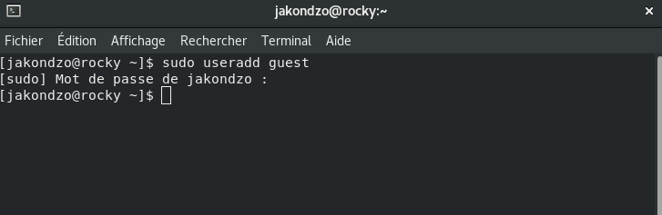
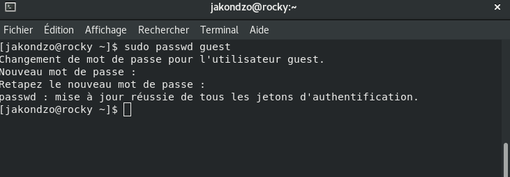
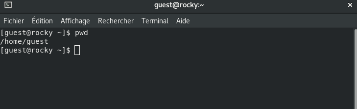
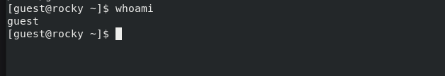
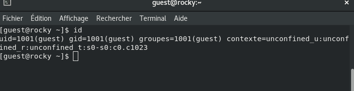
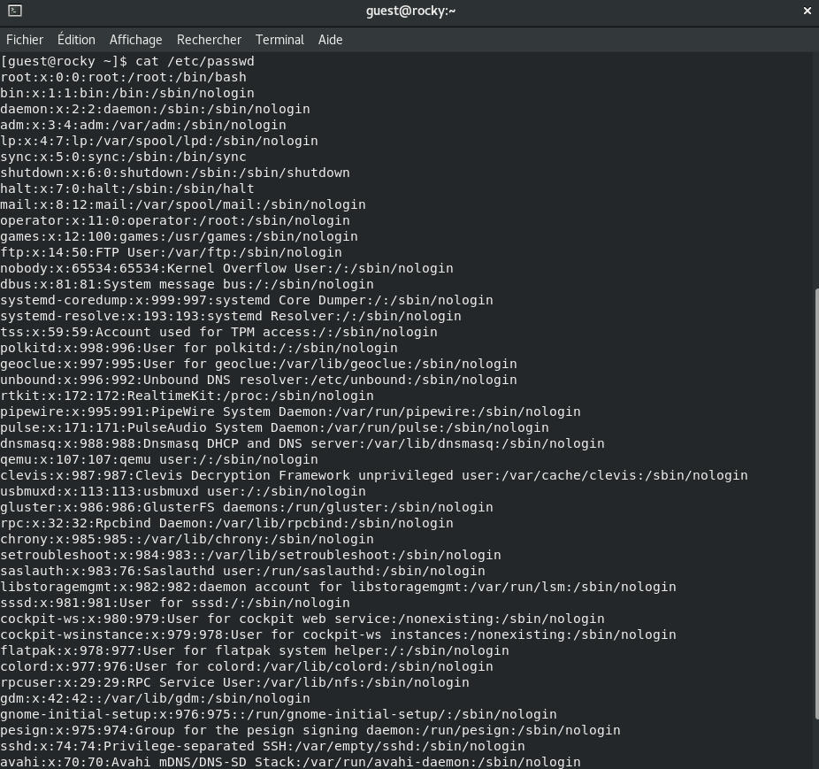
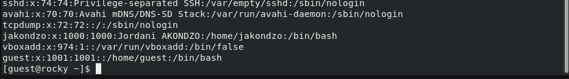
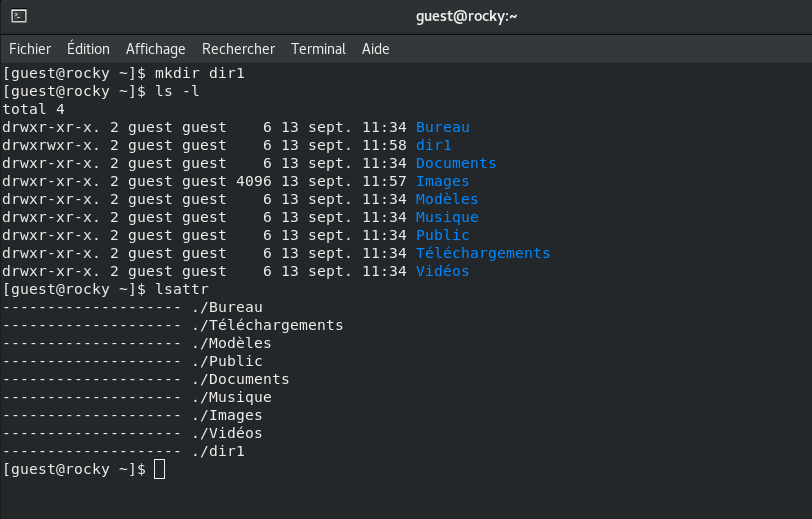
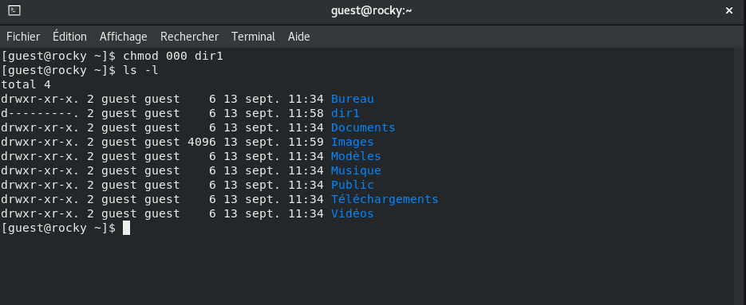
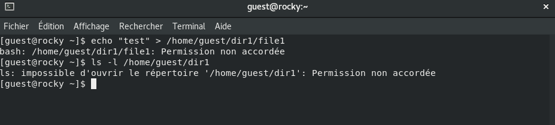

---
## Front matter
lang: ru-RU
title: Презентация по лабораторной работе №2
subtitle: Информационная безопасность
author:
  - Акондзо Жордани Лади Гаэл.
institute:
  - Российский университет дружбы народов, Москва, Россия
date: 14 сентября 2024

## i18n babel
babel-lang: russian
babel-otherlangs: english

## Formatting pdf
toc: false
toc-title: Содержание
slide_level: 2
aspectratio: 169
section-titles: true
theme: metropolis
header-includes:
 - \metroset{progressbar=frametitle,sectionpage=progressbar,numbering=fraction}
 - '\makeatletter'
 - '\beamer@ignorenonframefalse'
 - '\makeatother'
---

# Информация

## Докладчик

:::::::::::::: {.columns align=center}
::: {.column width="70%"}

  * Акондзо Жордани Лади Гаэл.
  * студент 4-го курса группы НКНбд-01-21
  * 1032215649
  * Российский университет дружбы народов
  * [GitHub](https://github.com/Jordaniakondzo)

:::
::::::::::::::

# Вводная часть

## Актуальность

- Обеспечение безопасности
- Предотвращение пересечений между пользовательскими аккаунтами

## Цели и задачи

- Приобретение практических навыков работы в консоли с атрибутами файлов
- Закрепление теоретических основ дискреционного разграничения доступа в современных системах с открытым кодом на базе ОС Linux

## Материалы и методы

- Веб-сервис `GitHub` для работы с репозиториями
- Программа для виртуализации ОС `VirtualBox`
- Процессор `pandoc` для входного формата Markdown
- Результирующие форматы
	- `pdf`
	- `docx`
- Автоматизация процесса создания: `Makefile`

# Ход работы

## Создание нового пользователя

## Поиск сведений об аккаунте

## Просмотр файла /etc/passwd командой
*cat /etc/passwd*

## Создание папки и просмотр прав доступа

## Изменение прав доступа

## Попытка создания файла

# Результаты

## Результаты работы

- Приобретены навыки работы с атрибутами файлов
- Отточены знания об ограничении доступа в системах на базе Linux
- Выявлены минимальные права на директорию и на файл для разных операций
