---
## Front matter
title: "Шаблон отчёта по лабораторной работе №2"
subtitle: "Дискреционное разграничение прав в Linux. Основные
атрибуты"
author: "Акондзо Жордани Лади Гаэл"

## Generic otions
lang: ru-RU
toc-title: "Содержание"

## Bibliography
bibliography: bib/cite.bib
csl: pandoc/csl/gost-r-7-0-5-2008-numeric.csl

## Pdf output format
toc: true # Table of contents
toc-depth: 2
lof: true # List of figures
lot: true # List of tables
fontsize: 12pt
linestretch: 1.5
papersize: a4
documentclass: scrreprt
## I18n polyglossia
polyglossia-lang:
  name: russian
  options:
	- spelling=modern
	- babelshorthands=true
polyglossia-otherlangs:
  name: english
## I18n babel
babel-lang: russian
babel-otherlangs: english
## Fonts
mainfont: PT Serif
romanfont: PT Serif
sansfont: PT Sans
monofont: PT Mono
mainfontoptions: Ligatures=TeX
romanfontoptions: Ligatures=TeX
sansfontoptions: Ligatures=TeX,Scale=MatchLowercase
monofontoptions: Scale=MatchLowercase,Scale=0.9
## Biblatex
biblatex: true
biblio-style: "gost-numeric"
biblatexoptions:
  - parentracker=true
  - backend=biber
  - hyperref=auto
  - language=auto
  - autolang=other*
  - citestyle=gost-numeric
## Pandoc-crossref LaTeX customization
figureTitle: "Рис."
listingTitle: "Листинг"
lofTitle: "Список иллюстраций"
lolTitle: "Листинги"
## Misc options
indent: true
header-includes:
  - \usepackage{indentfirst}
  - \usepackage{float} # keep figures where there are in the text
  - \floatplacement{figure}{H} # keep figures where there are in the text
---

# 1. Цель работы

Получение практических навыков работы в консоли с атрибутами файлов, закрепление теоретических основ дискреционного разграничения доступа в современных системах с открытым кодом на базе ОС Linux.

# 2. Выполнение лабораторной работы

1. Создал учётную запись пользователя guest (использую учётную запись администратора) с помощью команды *sudo useradd guest* (рис. [-@fig:001])

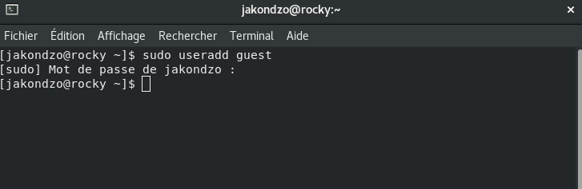{ #fig:001 width=70% }

2. Задал пароль для пользователя guest (использую учётную запись администратора): *passwd guest.* (рис. [-@fig:002])

{ #fig:002 width=70% }

3. Вошёл в систему от имени пользователя *guest.* (рис. [-@fig:003])

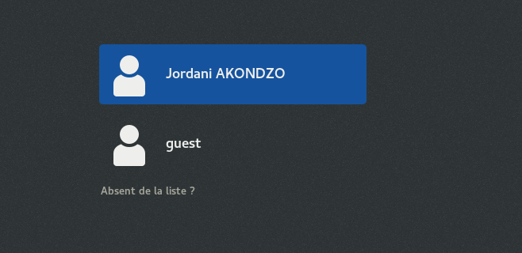{ #fig:003 width=70% }

4. Определил директорию, в которой вы находитесь, командой *pwd.* (рис. [-@fig:004])

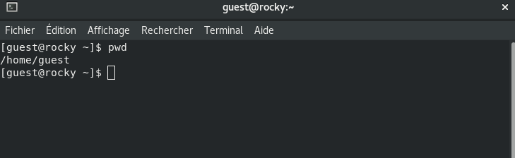{ #fig:004 width=70% }

5. Уточнил имя пользователя командой *whoami.* (рис. [-@fig:005])

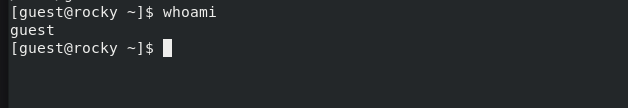{ #fig:005 width=70% }

6. Уточнил имя пользователя, группу, а также группы, куда входит пользователь, командой *id.* (рис. [-@fig:006])

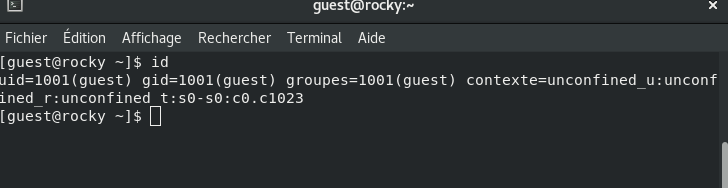{ #fig:006 width=70% }

7. Сравнил полученную информацию об имени пользователя с данными, выводимыми в приглашении командной строки.

8. Просмотрел файл */etc/passwd командой cat /etc/passwd.* (рис. [-@fig:007]), (рис. [-@fig:008]) и (рис. [-@fig:009])

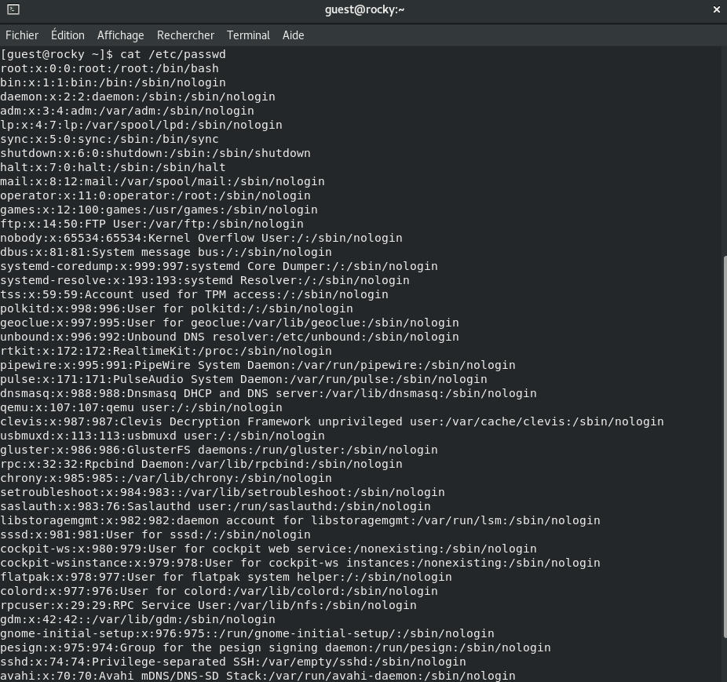{ #fig:007 width=70% }

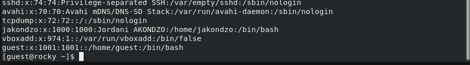{ #fig:008 width=70% }

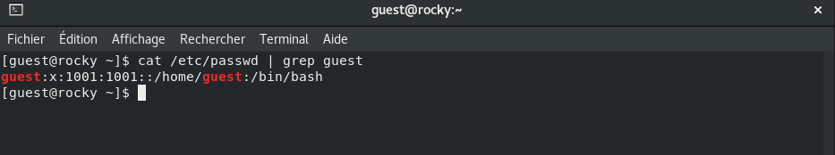{ #fig:009 width=70% }

9. Определил существующие в системе директории командой *ls -l /home/.* (рис. [-@fig:010])

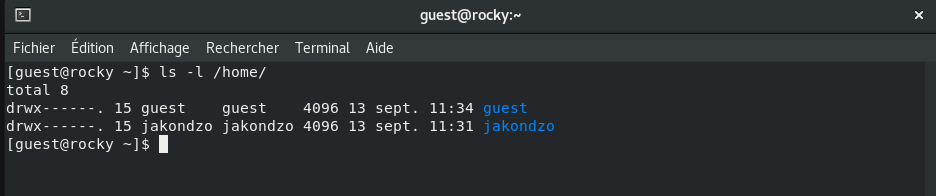{ #fig:010 width=70% }

10. Проверил установленные расширенные атрибуты на поддиректориях, находящихся в директории */home*, командой *lsattr /home.* (рис. [-@fig:011])

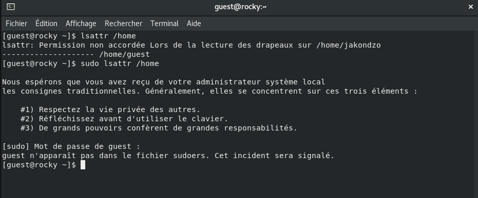{ #fig:011 width=70% }

11. Создал в домашней директории поддиректорию **dir1** командой *mkdir dir1.* (рис. [-@fig:012])

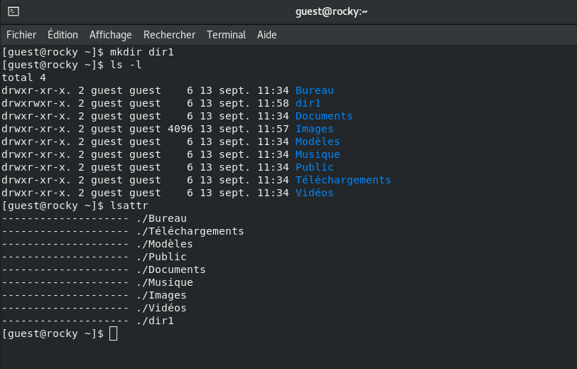{ #fig:012 width=70% }

12. Снял с директории dir1 все атрибуты командой *chmod 000 dir1.* (рис. [-@fig:013])

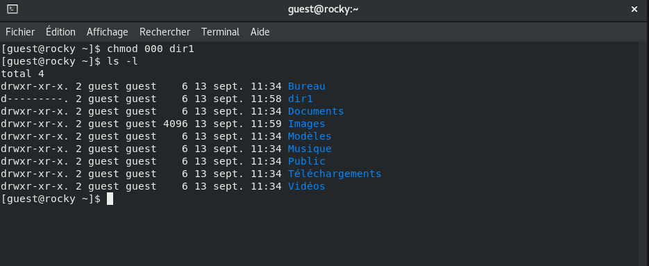{ #fig:013 width=70% }

13. Попытался создать в директории dir1 файл file1 командой echo *"test" >
/home/guest/dir1/file1, но отказали в доступе.* (рис. [-@fig:014])

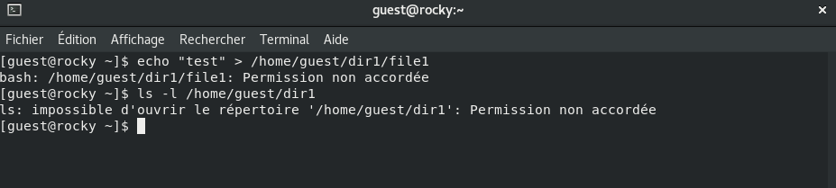{ #fig:014 width=70% }

# Выводы

В результате лабораторной работы мной были получены навыки работы с атрибутами файлов, закреплены знания о правах доступа в системах на базе ОС
Linux, а также были выявлены минимальные необходимые права доступа для
выполнения операций над файлами и директориями.

