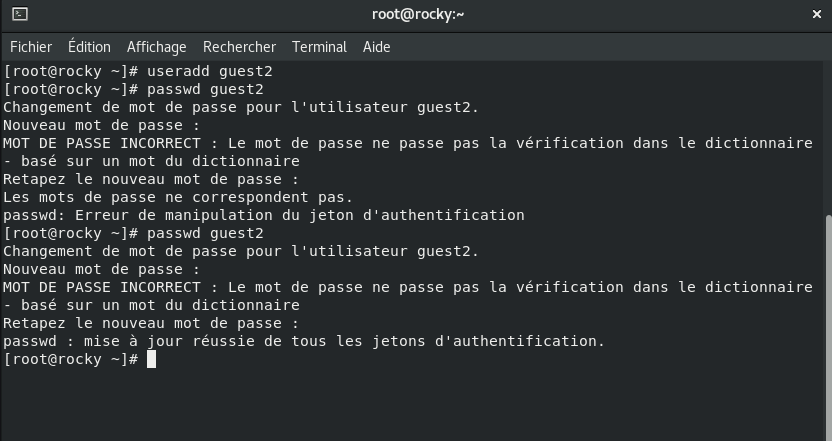
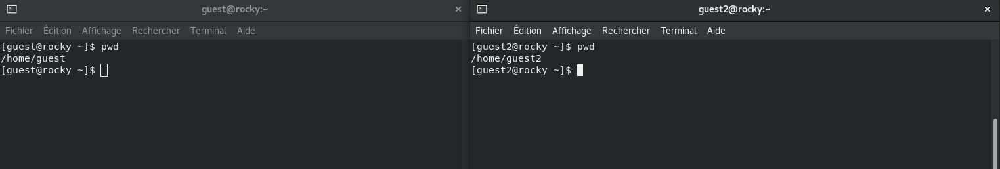
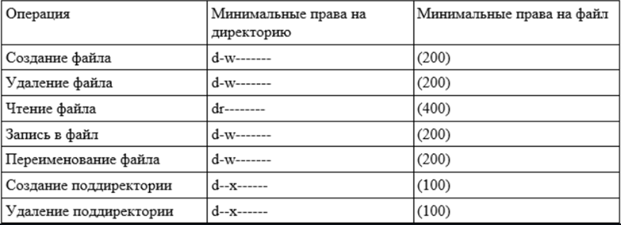

---
## Front matter
lang: ru-RU
title: Презентация по лабораторной работе №3
subtitle: Информационная безопасность
author:
  - Акондзо Жордани Лади Гаэл.
institute:
  - Российский университет дружбы народов, Москва, Россия
date: 19 сентября 2024

## i18n babel
babel-lang: russian
babel-otherlangs: english

## Formatting pdf
toc: false
toc-title: Содержание
slide_level: 2
aspectratio: 169
section-titles: true
theme: metropolis
header-includes:
 - \metroset{progressbar=frametitle,sectionpage=progressbar,numbering=fraction}
 - '\makeatletter'
 - '\beamer@ignorenonframefalse'
 - '\makeatother'
---

# Информация

## Докладчик

:::::::::::::: {.columns align=center}
::: {.column width="70%"}

  * Акондзо Жордани Лади Гаэл.
  * студент 4-го курса группы НКНбд-01-21
  * 1032215649
  * Российский университет дружбы народов
  * [GitHub](https://github.com/Jordaniakondzo)

:::
::::::::::::::

# Вводная часть

## Актуальность

- Обеспечение безопасности
- Предотвращение пересечений между пользовательскими аккаунтами
- Совместный доступ к файлам

## Цели и задачи

- Закрепление практических навыков работы в консоли с атрибутами файлов
- Закрепление теоретических основ дискреционного разграничения доступа в современных системах с открытым кодом на базе ОС Linux

## Материалы и методы

- Веб-сервис `GitHub` для работы с репозиториями
- Программа для виртуализации ОС `VirtualBox`
- Процессор `pandoc` для входного формата Markdown
- Результирующие форматы
	- `pdf`
	- `docx`
- Автоматизация процесса создания: `Makefile`

# Выполнение лабораторной работы

## В установленной операционной системе создал учётную запись пользователя guest (использую учётную запись администратора): *useradd guest* (рис. [-@fig:001]).
*Ну как видно она уже создана на 2-ой лаб.*

{ #fig:001 width=70% }

## Задал пароль для пользователя guest (использую учётную запись администратора) на 2-ой лаб: -passwd guest- (рис. [-@fig:002]).

{ #fig:002 width=70% }

## Аналогично создал второго пользователя guest2 (рис. [-@fig:003]).

{ #fig:003 width=70% }

## Добавил пользователя **guest2** в группу **guest**:
*gpasswd -a guest2 guest* (рис. [-@fig:004]).

{ #fig:004 width=70% }

## Осуществил вход в систему от двух пользователей на двух разных консолях: guest на первой консоли и guest2 на второй консоли (рис. [-@fig:005]). 

{ #fig:005 width=70% }

## Для обоих пользователей командой pwd определил директорию, в которой вы находитесь. Сравнил её с приглашениями командной строки (рис. [-@fig:006]).

{ #fig:006 width=70% }

## Уточнил имя вашего пользователя, его группу, кто входит в неё и к каким группам принадлежит он сам. Определил командами *groups guest и groups guest2*, в какие группы входят пользователи guest и guest2. Сравнил вывод команды groups с выводом команд *id -Gn и id -G* (рис. [-@fig:007]).

{ #fig:007 width=70% }

## Сравнил полученную информацию с содержимым файла /etc/group. Просмотрил файл командой *cat /etc/group* (рис. [-@fig:008]) и (рис. [-@fig:009]).

{ #fig:008 width=70% }

{ #fig:009 width=70% }

## От имени пользователя guest2 выполните регистрацию пользователя **guest2** в группе guest командой *newgrp guest* (рис. [-@fig:010]).

{ #fig:010 width=70% }

## От имени пользователя guest изменил права директории /home/guest, разрешив все действия для пользователей группы:
*chmod g+rwx /home/guest* (рис. [-@fig:011]).

{ #fig:011 width=70% }

## От имени пользователя guest снимил с директории **/home/guest/dir1** все атрибуты командой *chmod 000 dirl* (рис. [-@fig:012]) и (рис. [-@fig:013]).

{ #fig:012 width=70% }

{ #fig:013 width=70% }

## Исходя из полученной информации, была заполнена таблица.

## *Минимальные права для совершения операций от имени пользователей входящих в группу.*

# Результаты

## Результаты работы

- Отточены навыки работы с атрибутами файлов
- Отточены знания об ограничении доступа в системах на базе Linux
- Выявлены минимальные права на директорию и на файл для разных операций