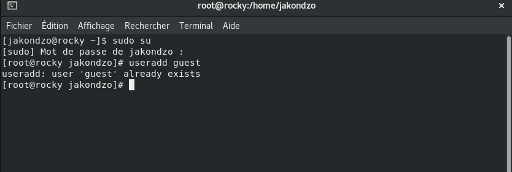

---
## Front matter
title: "Отчёта по лабораторной работе №3"
subtitle: "Дискреционное разграничение прав в Linux. Два пользователя"
author: "Акондзо Жордани Лади Гаэл"

## Generic otions
lang: ru-RU
toc-title: "Содержание"

## Bibliography
bibliography: bib/cite.bib
csl: pandoc/csl/gost-r-7-0-5-2008-numeric.csl

## Pdf output format
toc: true # Table of contents
toc-depth: 2
lof: true # List of figures
lot: true # List of tables
fontsize: 12pt
linestretch: 1.5
papersize: a4
documentclass: scrreprt
## I18n polyglossia
polyglossia-lang:
  name: russian
  options:
	- spelling=modern
	- babelshorthands=true
polyglossia-otherlangs:
  name: english
## I18n babel
babel-lang: russian
babel-otherlangs: english
## Fonts
mainfont: PT Serif
romanfont: PT Serif
sansfont: PT Sans
monofont: PT Mono
mainfontoptions: Ligatures=TeX
romanfontoptions: Ligatures=TeX
sansfontoptions: Ligatures=TeX,Scale=MatchLowercase
monofontoptions: Scale=MatchLowercase,Scale=0.9
## Biblatex
biblatex: true
biblio-style: "gost-numeric"
biblatexoptions:
  - parentracker=true
  - backend=biber
  - hyperref=auto
  - language=auto
  - autolang=other*
  - citestyle=gost-numeric
## Pandoc-crossref LaTeX customization
figureTitle: "Рис."
lofTitle: "Список иллюстраций"
## Misc options
indent: true
header-includes:
  - \usepackage{indentfirst}
  - \usepackage{float} # keep figures where there are in the text
  - \floatplacement{figure}{H} # keep figures where there are in the text
---

# Цель работы

*Получение практических навыков работы в консоли с атрибутами файлов для групп пользователей.*

# Выполнение лабораторной работы

1. В установленной операционной системе создал учётную запись пользователя guest (использую учётную запись администратора): *useradd guest* (рис. [-@fig:001]).
*Ну как видно она уже создана на 2-ой лаб.*

{ #fig:001 width=70% }

2. Задал пароль для пользователя guest (использую учётную запись администратора) на 2-ой лаб: -passwd guest- (рис. [-@fig:002]).

{ #fig:002 width=70% }

3. Аналогично создал второго пользователя guest2 (рис. [-@fig:003]).

{ #fig:003 width=70% }

4. Добавил пользователя **guest2** в группу **guest**:
*gpasswd -a guest2 guest* (рис. [-@fig:004]).

{ #fig:004 width=70% }

5. Осуществил вход в систему от двух пользователей на двух разных консолях: guest на первой консоли и guest2 на второй консоли (рис. [-@fig:005]). 

{ #fig:005 width=70% }

6. Для обоих пользователей командой pwd определил директорию, в которой вы находитесь. Сравнил её с приглашениями командной строки (рис. [-@fig:006]).

{ #fig:006 width=70% }

7. Уточнил имя вашего пользователя, его группу, кто входит в неё и к каким группам принадлежит он сам. Определил командами *groups guest и groups guest2*, в какие группы входят пользователи guest и guest2. Сравнил вывод команды groups с выводом команд *id -Gn и id -G* (рис. [-@fig:007]).

{ #fig:007 width=70% }

8. Сравнил полученную информацию с содержимым файла /etc/group. Просмотрил файл командой *cat /etc/group* (рис. [-@fig:008]) и (рис. [-@fig:009]).

{ #fig:008 width=70% }

{ #fig:009 width=70% }

9. От имени пользователя guest2 выполните регистрацию пользователя **guest2** в группе guest командой *newgrp guest* (рис. [-@fig:010]).

{ #fig:010 width=70% }

10. От имени пользователя guest изменил права директории /home/guest, разрешив все действия для пользователей группы:
*chmod g+rwx /home/guest* (рис. [-@fig:011]).

{ #fig:011 width=70% }

11. От имени пользователя guest снимил с директории **/home/guest/dir1** все атрибуты командой *chmod 000 dirl* (рис. [-@fig:012]) и (рис. [-@fig:013]).

{ #fig:012 width=70% }

{ #fig:013 width=70% }

Исходя из полученной информации, была заполнена таблица.

*Минимальные права для совершения операций от имени пользователей входящих в группу.*

# Выводы

Получил практические навыки работы в консоли с атрибутами файлов для групп пользователей.

