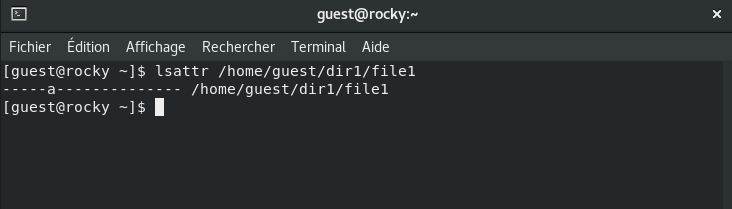
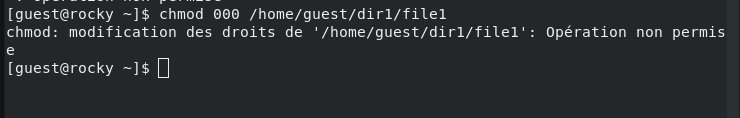

---
## Front matter
lang: ru-RU
title: Презентация по лабораторной работе №4
subtitle: Информационная безопасность
author:
  - Акондзо Жордани Лади Гаэл.
institute:
  - Российский университет дружбы народов, Москва, Россия
date: 26 сентября 2024

## i18n babel
babel-lang: russian
babel-otherlangs: english

## Formatting pdf
toc: false
toc-title: Содержание
slide_level: 2
aspectratio: 169
section-titles: true
theme: metropolis
header-includes:
 - \metroset{progressbar=frametitle,sectionpage=progressbar,numbering=fraction}
 - '\makeatletter'
 - '\beamer@ignorenonframefalse'
 - '\makeatother'
---

# Информация

## Докладчик

:::::::::::::: {.columns align=center}
::: {.column width="70%"}

  * Акондзо Жордани Лади Гаэл.
  * студент 4-го курса группы НКНбд-01-21
  * 1032215649
  * Российский университет дружбы народов
  * [GitHub](https://github.com/Jordaniakondzo)

:::
::::::::::::::

# Вводная часть

## Актуальность

- Обеспечение безопасности
- Предотвращение пересечений между пользовательскими аккаунтами
- Совместный доступ к файлам

## Цели и задачи

- Закрепление практических навыков работы в консоли с атрибутами файлов
- Закрепление теоретических основ дискреционного разграничения доступа в современных системах с открытым кодом на базе ОС Linux

## Материалы и методы

- Веб-сервис `GitHub` для работы с репозиториями
- Программа для виртуализации ОС `VirtualBox`
- Процессор `pandoc` для входного формата Markdown
- Результирующие форматы
	- `pdf`
	- `docx`
- Автоматизация процесса создания: `Makefile`

# Выполнение лабораторной работы

## Проверка расширенных атрибутов файла:

- От имени пользователя **guest** определил расширенные атрибуты файла командой */home/guest/dir1/file1*.

## Изменение прав доступа к файлу:

- Установил права доступа на файл **file1**, разрешающие чтение и запись только для владельца:

## Попытка установки атрибута `a` от имени пользователя guest:

- Попробовал установить атрибут `a` (добавление только) для файла от имени пользователя **guest:**

- Ожидается отказ в выполнении операции, так как требуются права администратора.

## Установка атрибута `a` с правами администратора:

- Повышаем привилегии с помощью команды `su` и устанавливаем атрибут a для файла:

## Проверка атрибута:

- Проверил, что атрибут был установлен успешно:

## Добавление данных в файл:

- Выполнил дозапись в файл **file1** слова *"test"*:
- Прочитат файл и убеделся, что данные были успешно добавлены с помощью командой *`cat /home/guest/dir1/file1`*:

## Попытка удаления или перезаписи файла:

- Попробовал удалить файл, перезаписать его или переименовать:

## Изменение прав доступа к файлу:

- Попробовал изменить права доступа к файлу с помощью команды:

- Не удалось выполнить команду с установленным атрибутом `a.`

## Снятие атрибута `a`(append-only):

- От имени суперпользователя снимил атрибут `a` с файла:

- Повторил операции, которые не удавалось выполнить ранее, и занесил результаты в отчёт.

## Установка атрибута `i` (immutable):

- Повторите предыдущие действия, но замените атрибут a на атрибут `i`, который делает файл неизменяемым.
- Попробуйте дозаписать данные, удалить или переименовать файл. Ожидается, что операции будут заблокированы.
- Снимите атрибут `i`, чтобы вернуть возможность изменения файла.

# Выводы

В ходе выполнения данной лабораторной работы я изучил работу с расширенными атрибутами файлов в ОС Linux, такими как `a` **(добавление только)** и `i` **(неизменяемый)**. Узнал, как эти атрибуты влияют на возможности изменения файлов и применяются для усиления безопасности в системах Linux.
