---
## Front matter
title: "Отчёта по лабораторной работе №4"
subtitle: "Дискреционное разграничение прав в Linux. Расширенные атрибуты"
author: "Акондзо Жордани Лади Гаэл"

## Generic otions
lang: ru-RU
toc-title: "Содержание"

## Bibliography
bibliography: bib/cite.bib
csl: pandoc/csl/gost-r-7-0-5-2008-numeric.csl

## Pdf output format
toc: true # Table of contents
toc-depth: 2
lof: true # List of figures
lot: true # List of tables
fontsize: 12pt
linestretch: 1.5
papersize: a4
documentclass: scrreprt
## I18n polyglossia
polyglossia-lang:
  name: russian
  options:
	- spelling=modern
	- babelshorthands=true
polyglossia-otherlangs:
  name: english
## I18n babel
babel-lang: russian
babel-otherlangs: english
## Fonts
mainfont: PT Serif
romanfont: PT Serif
sansfont: PT Sans
monofont: PT Mono
mainfontoptions: Ligatures=TeX
romanfontoptions: Ligatures=TeX
sansfontoptions: Ligatures=TeX,Scale=MatchLowercase
monofontoptions: Scale=MatchLowercase,Scale=0.9
## Biblatex
biblatex: true
biblio-style: "gost-numeric"
biblatexoptions:
  - parentracker=true
  - backend=biber
  - hyperref=auto
  - language=auto
  - autolang=other*
  - citestyle=gost-numeric
## Pandoc-crossref LaTeX customization
figureTitle: "Рис."
lofTitle: "Список иллюстраций"
## Misc options
indent: true
header-includes:
  - \usepackage{indentfirst}
  - \usepackage{float} # keep figures where there are in the text
  - \floatplacement{figure}{H} # keep figures where there are in the text
---

# Цель работы

Получить практические навыки работы с расширенными атрибутами файлов в консольной среде (CLI).

# Выполнение лабораторной работы

**1. Проверка расширенных атрибутов файла:**

- От имени пользователя **guest** определил расширенные атрибуты файла командой */home/guest/dir1/file1* (рис. [-@fig:001])

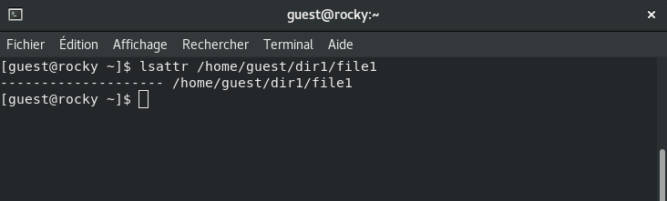{ #fig:001 width=70% }

**2. Изменение прав доступа к файлу:**

- Установил права доступа на файл **file1**, разрешающие чтение и запись только для владельца: (рис. [-@fig:002])

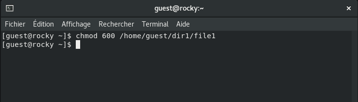{ #fig:002 width=70% }

**3. Попытка установки атрибута `a` от имени пользователя guest:**

- Попробовал установить атрибут `a` (добавление только) для файла от имени пользователя **guest:** (рис. [-@fig:003])

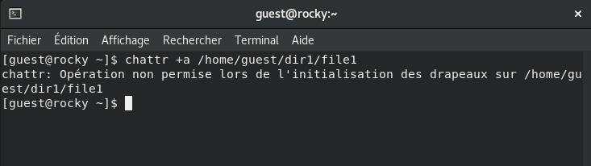{ #fig:003 width=70% }

- Ожидается отказ в выполнении операции, так как требуются права администратора.

**4. Установка атрибута `a` с правами администратора:**

- Повышаем привилегии с помощью команды `su` и устанавливаем атрибут a для файла: (рис. [-@fig:004])

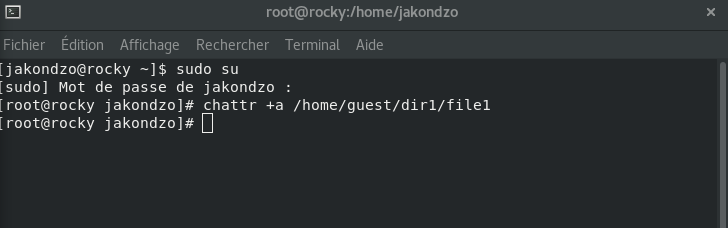{ #fig:004 width=70% }

**5. Проверка атрибута:**

- Проверил, что атрибут был установлен успешно: (рис. [-@fig:005])

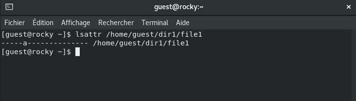{ #fig:005 width=70% }

**6. Добавление данных в файл:**

- Выполнил дозапись в файл **file1** слова *"test"*:
- Прочитат файл и убеделся, что данные были успешно добавлены с помощью командой *`cat /home/guest/dir1/file1`*: (рис. [-@fig:006])

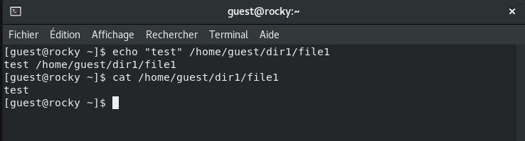{ #fig:006 width=70% }

**7. Попытка удаления или перезаписи файла:**

- Попробовал удалить файл, перезаписать его или переименовать: (рис. [-@fig:007])

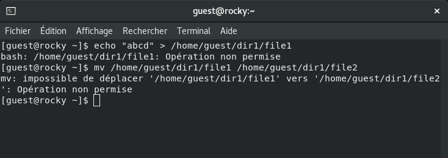{ #fig:007 width=70% }

**8. Изменение прав доступа к файлу:**

- Попробовал изменить права доступа к файлу с помощью команды: (рис. [-@fig:008])

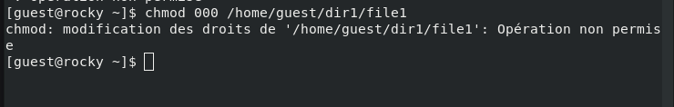{ #fig:008 width=70% }

- Не удалось выполнить команду с установленным атрибутом `a.`

**9. Снятие атрибута `a`(append-only):**

- От имени суперпользователя снимил атрибут `a` с файла: (рис. [-@fig:009])

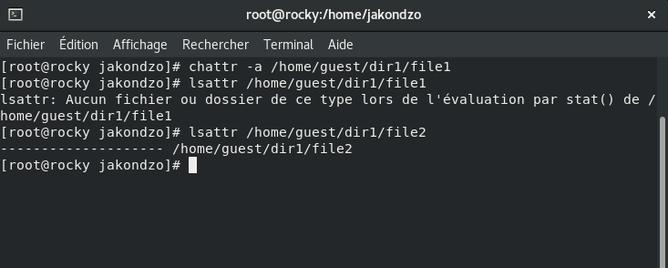{ #fig:009 width=70% }

- Повторил операции, которые не удавалось выполнить ранее, и занесил результаты в отчёт (рис. [-@fig:010]).

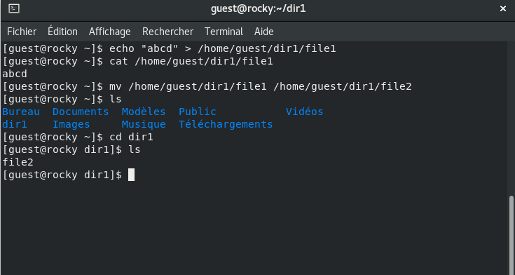{ #fig:010 width=70% }

**10. Установка атрибута `i` (immutable):**

- Повторите предыдущие действия, но замените атрибут a на атрибут `i`, который делает файл неизменяемым.
- Попробуйте дозаписать данные, удалить или переименовать файл. Ожидается, что операции будут заблокированы.
- Снимите атрибут `i`, чтобы вернуть возможность изменения файла (рис. [-@fig:011]).

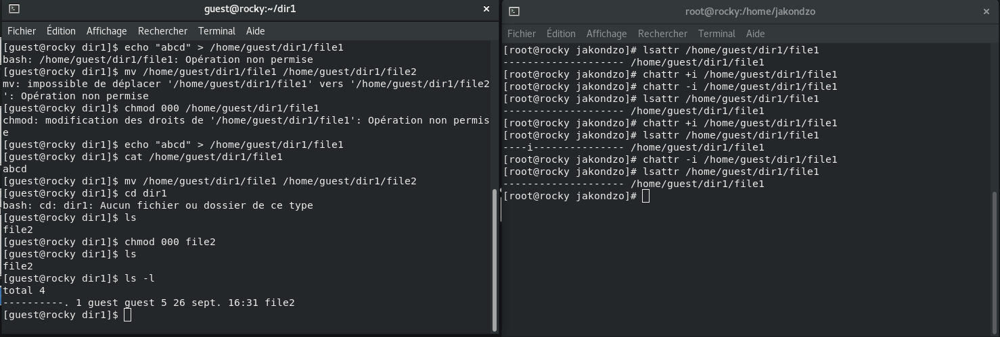{ #fig:011 width=70% }

# Выводы

В ходе выполнения данной лабораторной работы я изучил работу с расширенными атрибутами файлов в ОС Linux, такими как `a` **(добавление только)** и `i` **(неизменяемый)**. Узнал, как эти атрибуты влияют на возможности изменения файлов и применяются для усиления безопасности в системах Linux.
