---
## Front matter
lang: ru-RU
title: Презентация по лабораторной работе №5
subtitle: Информационная безопасность
author:
  - Акондзо Жордани Лади Гаэл.
institute:
  - Российский университет дружбы народов, Москва, Россия
date: 03 Октября 2024

## i18n babel
babel-lang: russian
babel-otherlangs: english

## Formatting pdf
toc: false
toc-title: Содержание
slide_level: 2
aspectratio: 169
section-titles: true
theme: metropolis
header-includes:
 - \metroset{progressbar=frametitle,sectionpage=progressbar,numbering=fraction}
 - '\makeatletter'
 - '\beamer@ignorenonframefalse'
 - '\makeatother'
---

# Информация

## Докладчик

:::::::::::::: {.columns align=center}
::: {.column width="70%"}

  * Акондзо Жордани Лади Гаэл.
  * студент 4-го курса группы НКНбд-01-21
  * 1032215649
  * Российский университет дружбы народов
  * [GitHub](https://github.com/Jordaniakondzo)

:::
::::::::::::::

# Вводная часть

## Актуальность

- Обеспечение безопасности
- Предотвращение пересечений между пользовательскими аккаунтами
- Совместный доступ к файлам

## Цели и задачи

- Закрепление практических навыков работы в консоли с атрибутами файлов
- Закрепление теоретических основ дискреционного разграничения доступа в современных системах с открытым кодом на базе ОС Linux
- Изучение механизмов изменения идентификаторов, применение SetUID- и SetGID-битов.
- Изучение действия Sticky-бита на запись и удаление файлов в общей директории.

## Материалы и методы

- Веб-сервис `GitHub` для работы с репозиториями
- Программа для виртуализации ОС `VirtualBox`
- Процессор `pandoc` для входного формата Markdown
- Результирующие форматы
	- `pdf`
	- `docx`
- Автоматизация процесса создания: `Makefile`

# Выполнение лабораторной работы

## Часть 1: Изучение SetUID- и SetGID-битов

### Вход в систему.

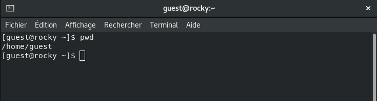

### Создание программы `simpleid.c` и её компиляция:

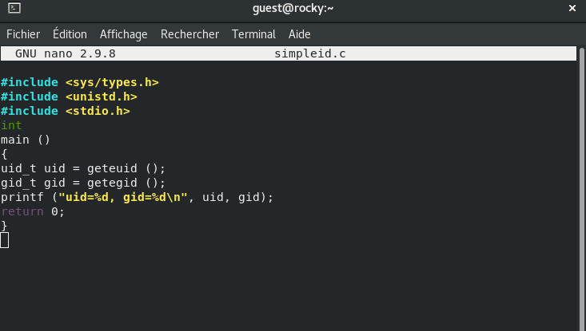

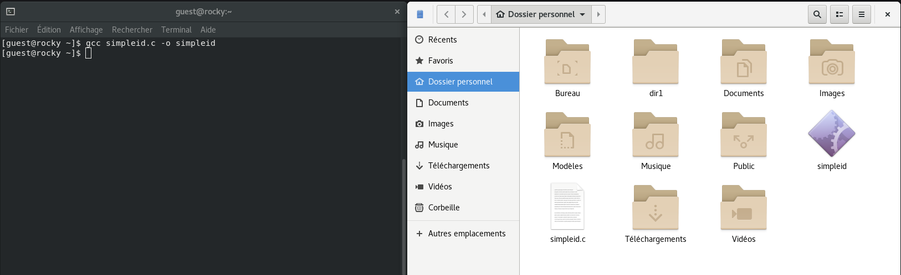

### Запуск программы `simpleid` и сравнение результата с системной командой `id`:

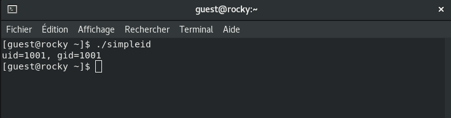

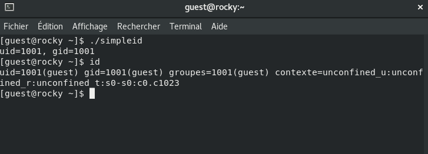

### Усложнение программы, создание simpleid2.c:

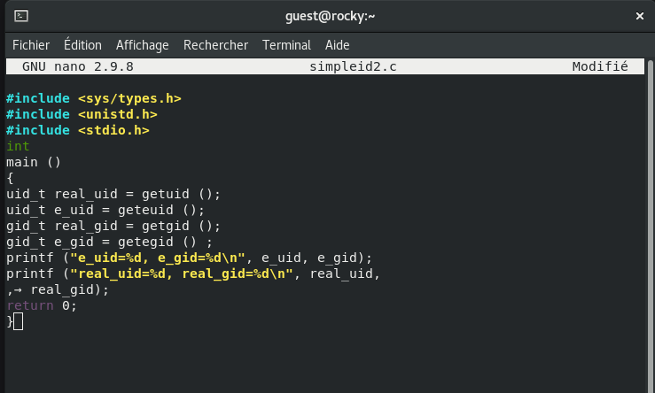

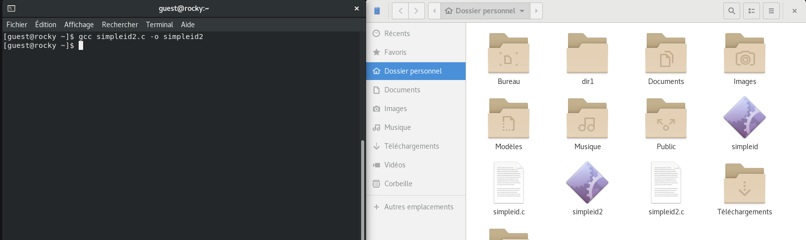

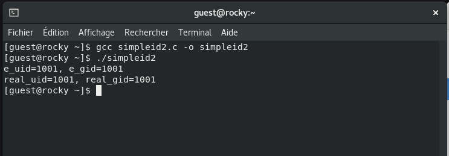

### Изменение владельца программы `simpleid2` на `root` и установка SetUID-бита:

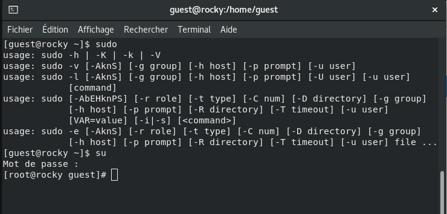

* Это позволит программе выполняться с правами пользователя root, независимо от того, кто её запускает.

### Запуск `simpleid2 и id` для сравнения результатов:

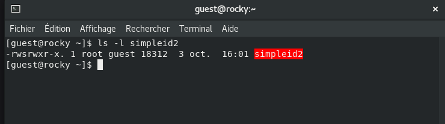

### Потом запустил программу и убедился, что эффективный UID соответствует root, даже если программа запускается обычным пользователем, что подтверждает работу SetUID.

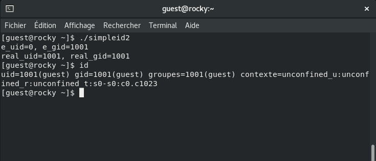

### Применение SetGID-бита к `simpleid2`:

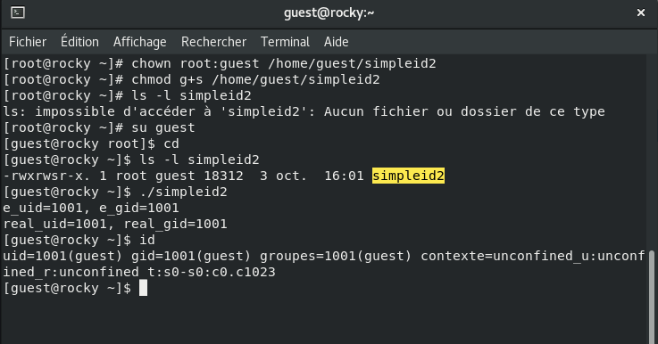

* Программа будет выполняться с правами группы guest. Сравниk результаты `./simpleid2 и id`, чтобы увидел, что GID соответствует группе владельца, указанной в SetGID.

### Создание программы `readfile.c` для чтения файла:

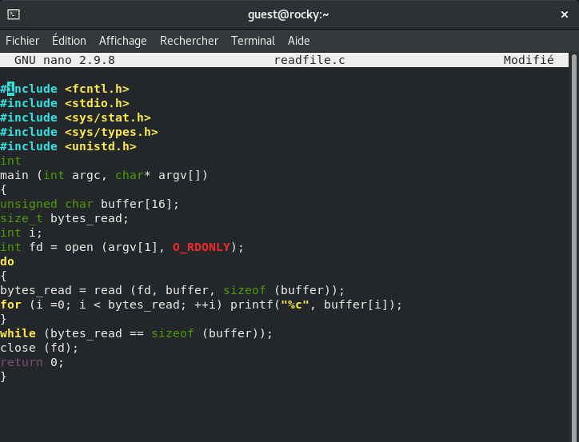

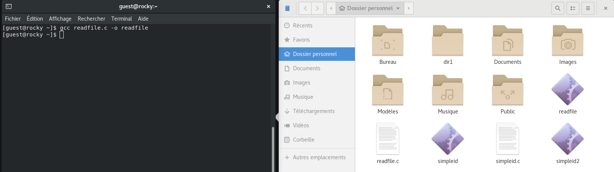

### Изменение владельца файла и прав доступа:

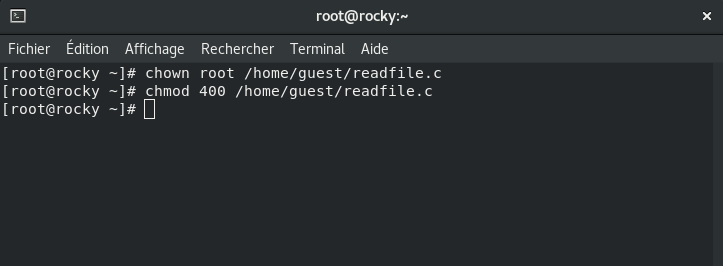

### Проверил, что пользователь guest не может прочитать файл readfile.c (должна быть ошибка "Permission denied")

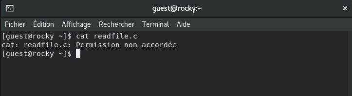

### Установка SetUID-бита на программу `readfile:`

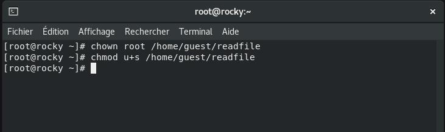

* Теперь программа будет выполняться с правами root.

### Проверка, может ли программа `readfile` прочитать файл `readfile.c`:

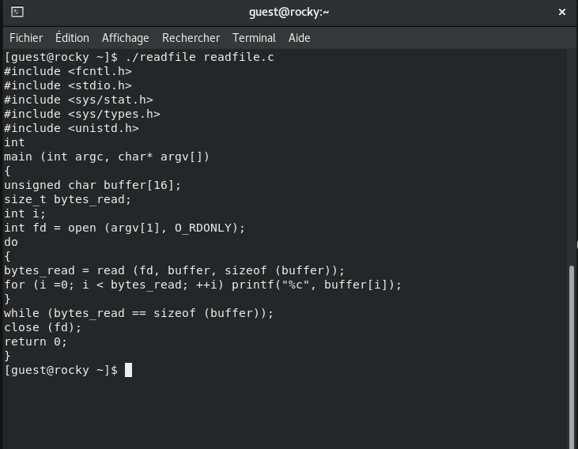

* Программа должна успешно прочитать файл благодаря SetUID-биту.

### Проверка, может ли программа readfile прочитать `файл /etc/shadow`:

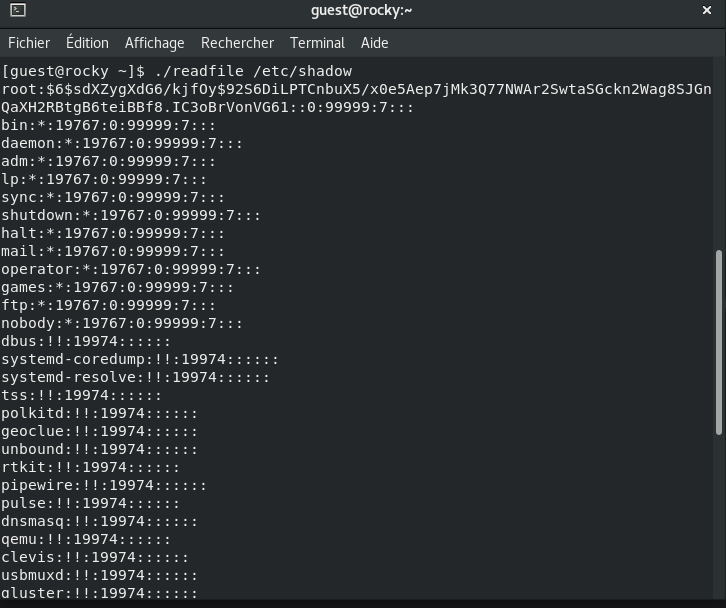

## Часть 2: Исследование Sticky-бита

### Проверка наличия Sticky-бита на директории `/tmp`:

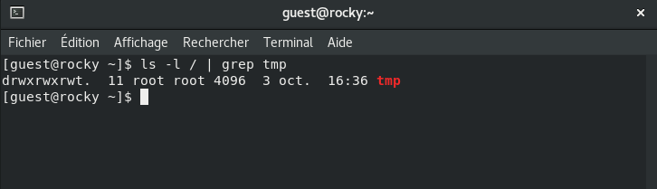

* Sticky-бит `(t)` указывает, что только владелец файла или root может удалить его, даже если у других пользователей есть права на запись.

### Создание файла в `/tmp` и изменение прав доступа:**

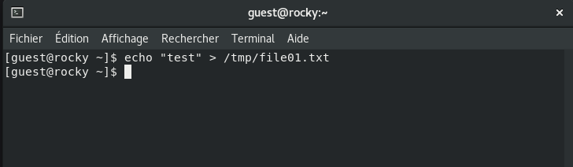

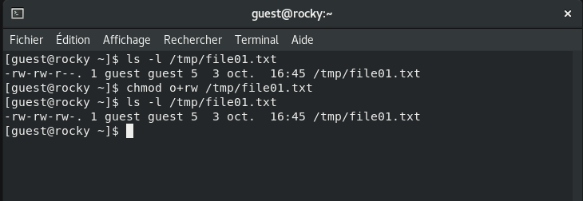

### Чтение и изменение файла другим пользователем guest2:

### Чтение и запись должны быть успешными, но удаление файла будет невозможно благодаря Sticky-биту

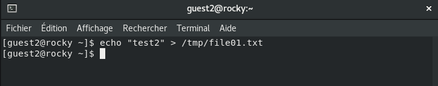

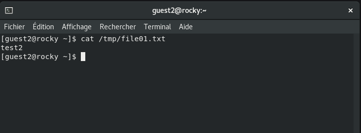

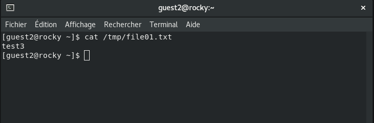

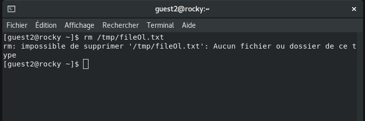

### Удаление Sticky-бита с `/tmp`:

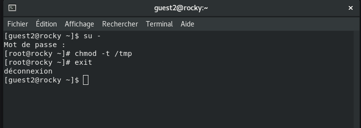

### От пользователя guest2 проверил, что атрибута t у директории `/tmp` нет:

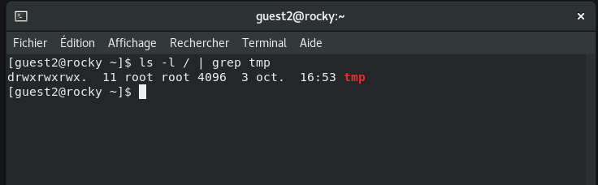

* Повторил попытку удаления файла от пользователя guest2. Теперь файл должен быть удалён, так как Sticky-бит больше не защищает его, но что-то не так.

### Возвращение Sticky-бита на `/tmp`:

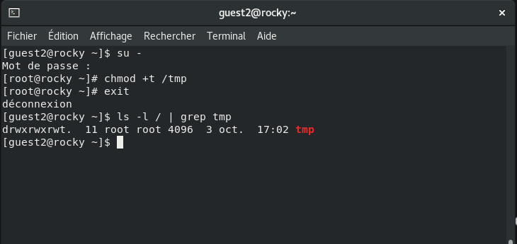

### Теперь повторил действия и убедился, что удаление файла снова запрещено для пользователей, не являющихся его владельцем.

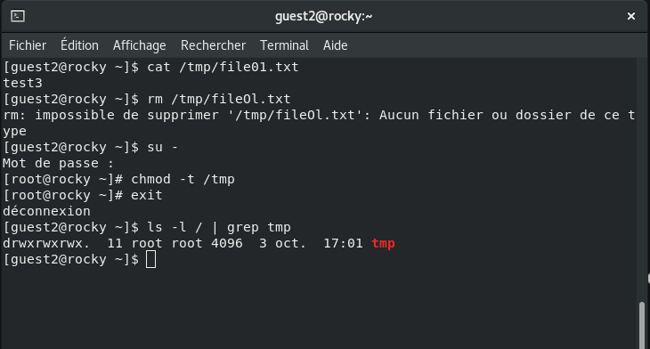

# Выводы

В ходе этой лабораторной работы было продемонстрировано, как использование **SetUID, SetGID, и Sticky-бито** позволяет управлять доступом и правами пользователей в системе Linux. **SetUID и SetGID** позволяют временно выполнять программы с правами владельца файла или его группы, что полезно для выполнения привилегированных задач. `Sticky-бит` защищает файлы в общих директориях, таких как `/tmp`, от удаления пользователями, не являющимися владельцами, что предотвращает потенциальные конфликты и нарушения безопасности.

