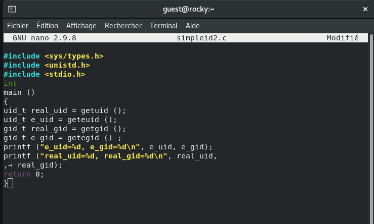

---
## Front matter
title: "Отчёта по лабораторной работе №5"
subtitle: "Дискреционное разграничение прав в Linux. Исследование влияния дополнительных атрибутов"
author: "Акондзо Жордани Лади Гаэл"

## Generic otions
lang: ru-RU
toc-title: "Содержание"

## Bibliography
bibliography: bib/cite.bib
csl: pandoc/csl/gost-r-7-0-5-2008-numeric.csl

## Pdf output format
toc: true # Table of contents
toc-depth: 2
lof: true # List of figures
lot: true # List of tables
fontsize: 12pt
linestretch: 1.5
papersize: a4
documentclass: scrreprt
## I18n polyglossia
polyglossia-lang:
  name: russian
  options:
	- spelling=modern
	- babelshorthands=true
polyglossia-otherlangs:
  name: english
## I18n babel
babel-lang: russian
babel-otherlangs: english
## Fonts
mainfont: PT Serif
romanfont: PT Serif
sansfont: PT Sans
monofont: PT Mono
mainfontoptions: Ligatures=TeX
romanfontoptions: Ligatures=TeX
sansfontoptions: Ligatures=TeX,Scale=MatchLowercase
monofontoptions: Scale=MatchLowercase,Scale=0.9
## Biblatex
biblatex: true
biblio-style: "gost-numeric"
biblatexoptions:
  - parentracker=true
  - backend=biber
  - hyperref=auto
  - language=auto
  - autolang=other*
  - citestyle=gost-numeric
## Pandoc-crossref LaTeX customization
figureTitle: "Рис."
lofTitle: "Список иллюстраций"
## Misc options
indent: true
header-includes:
  - \usepackage{indentfirst}
  - \usepackage{float} # keep figures where there are in the text
  - \floatplacement{figure}{H} # keep figures where there are in the text
---

# Цель работы

- Изучение механизмов изменения идентификаторов, применение SetUID- и SetGID-битов.
- Изучение действия Sticky-бита на запись и удаление файлов в общей директории.

# Выполнение лабораторной работы

## Часть 1: Изучение SetUID- и SetGID-битов
### Вопросы и Решение

1. Вошёл в систему от имени пользователя guest (рис. [-@fig:001]).

{ #fig:001 width=70% }

2. **Создание программы `simpleid.c` и её компиляция:**

* Программа `simpleid.c` выводит эффективный идентификатор пользователя (UID) и группы (GID). Она компилируется командой: (рис. [-@fig:002]) и (рис. [-@fig:003])

{ #fig:002 width=70% }

{ #fig:003 width=70% }

3. **Запуск программы `simpleid` и сравнение результата с системной командой `id`:**

* Программа `simpleid` и команда `id` показывают текущий эффективный UID и GID пользователя, что должно совпадать. (рис. [-@fig:004]) и (рис. [-@fig:005])

{ #fig:004 width=70% }

{ #fig:005 width=70% }

4. **Усложнение программы, создание simpleid2.c:**

* Добавил вывод реальных идентификаторов (UID и GID) и повторно компилируйте: (рис. [-@fig:006]), (рис. [-@fig:007]) и (рис. [-@fig:008])

{ #fig:006 width=70% }

{ #fig:007 width=70% }

{ #fig:008 width=70% }

5. **Изменение владельца программы `simpleid2` на `root` и установка SetUID-бита:**

* Использовал следующие команды: (рис. [-@fig:009])

{ #fig:009 width=70% }

* Использовал `sudo` или повысьте временно свои права с помощью `su` (рис. [-@fig:010]).

{ #fig:010 width=70% }

* Это позволит программе выполняться с правами пользователя root, независимо от того, кто её запускает.

6. **Запуск `simpleid2 и id` для сравнения результатов:**

* Сначала выполнил проверку правильности установки новых атрибутов и смены владельца файла `simpleid2.` (рис. [-@fig:011])

{ #fig:011 width=70% }

* Потом запустил программу и убедился, что эффективный UID соответствует root, даже если программа запускается обычным пользователем, что подтверждает работу SetUID (рис. [-@fig:012]).

{ #fig:012 width=70% }

7. **Применение SetGID-бита к `simpleid2`:**

* Изменил группу файла и установил SetGID: (рис. [-@fig:013])

{ #fig:013 width=70% }

* Программа будет выполняться с правами группы guest. Сравниk результаты `./simpleid2 и id`, чтобы увидел, что GID соответствует группе владельца, указанной в SetGID.

8. **Создание программы `readfile.c` для чтения файла:**

* Создал программу readfile.c, которая читает содержимое файла, и скомпилируйте её: (рис. [-@fig:014]) и (рис. [-@fig:015])

{ #fig:014 width=70% }

{ #fig:015 width=70% }

9. **Изменение владельца файла и прав доступа:**

* Сменил владельца файла `readfile.c на root`, установил права так, чтобы только root мог его читать: (рис. [-@fig:016])

{ #fig:016 width=70% }

* Проверил, что пользователь guest не может прочитать файл readfile.c (должна быть ошибка "Permission denied") (рис. [-@fig:017]).

{ #fig:017 width=70% }

10. **Установка SetUID-бита на программу `readfile:`**

* Сменил владельца на root и установите SetUID: (рис. [-@fig:018])

{ #fig:018 width=70% }

* Теперь программа будет выполняться с правами root.

11. **Проверка, может ли программа `readfile` прочитать файл `readfile.c`:**

* Запустите readfile как guest: (рис. [-@fig:019])

{ #fig:019 width=70% }

* Программа должна успешно прочитать файл благодаря SetUID-биту.

12. **Проверка, может ли программа readfile прочитать `файл /etc/shadow`:**

* Запустил `./readfile /etc/shadow`. Если SetUID-бит установлен, программа сможет читать этот файл, что демонстрирует возможность использования SetUID для доступа к привилегированным данным (рис. [-@fig:020]). 

{ #fig:020 width=70% }

## Часть 2: Исследование Sticky-бита

### Вопросы и Решение

1. **Проверка наличия Sticky-бита на директории `/tmp`:**

* Выполнил команду: (рис. [-@fig:021])

{ #fig:021 width=70% }

* Sticky-бит `(t)` указывает, что только владелец файла или root может удалить его, даже если у других пользователей есть права на запись.

2. **Создание файла в `/tmp` и изменение прав доступа:**

* Как пользователь guest, создайте файл `file01.txt в /tmp` и разрешил запись всем: (рис. [-@fig:022]) и (рис. [-@fig:023])

{ #fig:022 width=70% }

{ #fig:023 width=70% }

3. **Чтение и изменение файла другим пользователем guest2:**

* Как пользователь `guest2`, попытался: (рис. [-@fig:024])

{ #fig:024 width=70% }

* Чтение и запись должны быть успешными, но удаление файла будет невозможно благодаря Sticky-биту (рис. [-@fig:025]), (рис. [-@fig:026]), (рис. [-@fig:027]), (рис. [-@fig:028]) и (рис. [-@fig:029]).

{ #fig:025 width=70% }

{ #fig:026 width=70% }

{ #fig:027 width=70% }

{ #fig:028 width=70% }

{ #fig:029 width=70% }

4. **Удаление Sticky-бита с `/tmp`:**

* Как суперпользователь, снимите Sticky-бит: (рис. [-@fig:030])

{ #fig:030 width=70% }

* От пользователя guest2 проверил, что атрибута t у директории `/tmp` нет: (рис. [-@fig:031])

{ #fig:031 width=70% }

* Повторил попытку удаления файла от пользователя guest2. Теперь файл должен быть удалён, так как Sticky-бит больше не защищает его, но что-то не так.

5. **Возвращение Sticky-бита на `/tmp`:**

* Повторно установил Sticky-бит: (рис. [-@fig:032])

{ #fig:032 width=70% }

* Теперь повторил действия и убедился, что удаление файла снова запрещено для пользователей, не являющихся его владельцем (рис. [-@fig:033]).

{ #fig:033 width=70% }

# Выводы

В ходе этой лабораторной работы было продемонстрировано, как использование **SetUID, SetGID, и Sticky-бито** позволяет управлять доступом и правами пользователей в системе Linux. **SetUID и SetGID** позволяют временно выполнять программы с правами владельца файла или его группы, что полезно для выполнения привилегированных задач. `Sticky-бит` защищает файлы в общих директориях, таких как `/tmp`, от удаления пользователями, не являющимися владельцами, что предотвращает потенциальные конфликты и нарушения безопасности.
