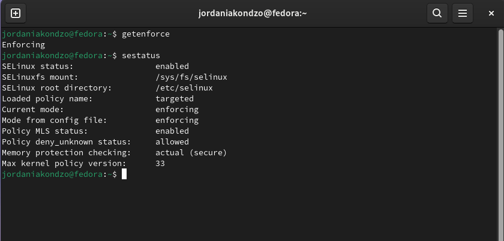
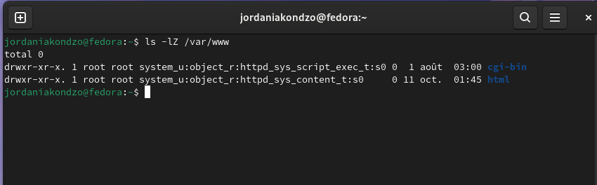
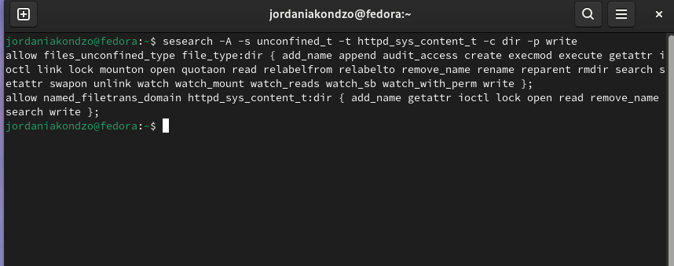
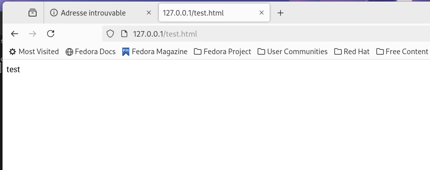
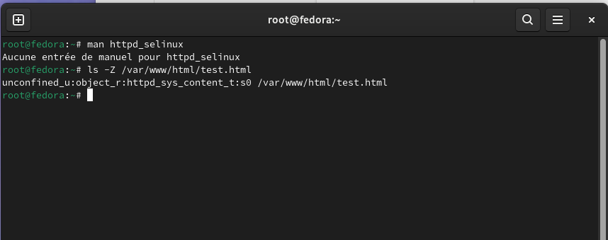
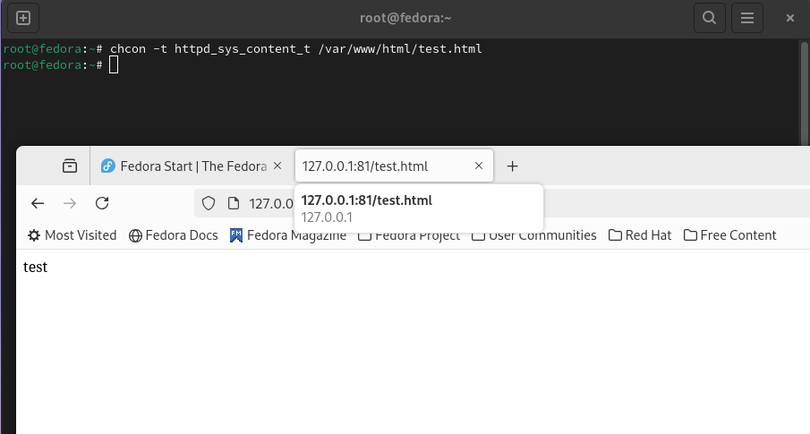
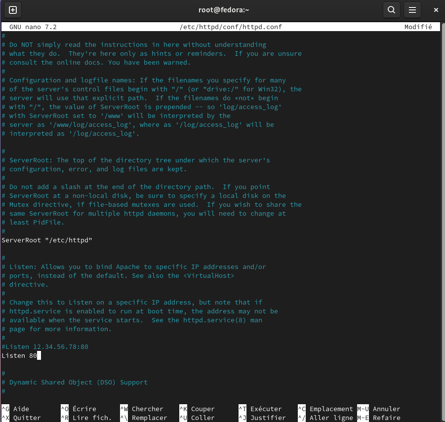

---
## Front matter
lang: ru-RU
title: Презентация по лабораторной работе №6
subtitle: Информационная безопасность
author:
  - Акондзо Жордани Лади Гаэл.
institute:
  - Российский университет дружбы народов, Москва, Россия
date: 12 Октября 2024

## i18n babel
babel-lang: russian
babel-otherlangs: english

## Formatting pdf
toc: false
toc-title: Содержание
slide_level: 2
aspectratio: 169
section-titles: true
theme: metropolis
header-includes:
 - \metroset{progressbar=frametitle,sectionpage=progressbar,numbering=fraction}
 - '\makeatletter'
 - '\beamer@ignorenonframefalse'
 - '\makeatother'
---

# Информация

## Докладчик

:::::::::::::: {.columns align=center}
::: {.column width="70%"}

  * Акондзо Жордани Лади Гаэл.
  * студент 4-го курса группы НКНбд-01-21
  * 1032215649
  * Российский университет дружбы народов
  * [GitHub](https://github.com/Jordaniakondzo)

:::
::::::::::::::

# Вводная часть

## Актуальность

- Обеспечение безопасности
- Предотвращение пересечений между пользовательскими аккаунтами
- Совместный доступ к файлам

# Цель работы

Цель данной лабораторной работы — развить навыки администрирования в операционной системе Linux с акцентом на использование технологии SELinux. Основное внимание уделено настройке SELinux для работы с веб-сервером Apache, что позволяет на практике проверить ограничения прав доступа.

# Теоретическое введение

## Подготовка стенда

Для выполнения лабораторной работы использовался дистрибутив Linux с включённой политикой SELinux targeted и режимом enforcing. В качестве веб-сервера использовался Apache, который был настроен для работы на портах 80 и 81. Важно было убедиться, что iptables настроен корректно и не блокирует доступ к данным портам.

## Материалы и методы

- Веб-сервис `GitHub` для работы с репозиториями
- Программа для виртуализации ОС `VirtualBox`
- Процессор `pandoc` для входного формата Markdown
- Результирующие форматы
	- `pdf`
	- `docx`
- Автоматизация процесса создания: `Makefile`

# Выполнение лабораторной работы

## Проверка статуса SELinux

*Результат показал, что система настроена корректно для выполнения лабораторной работы.*

## Настройка веб-сервера Apache

## Проверка контекста SELinux для Apache 

*Эта команда показала, что процессы Apache работают с контекстом httpd_t, что позволяет серверу правильно обрабатывать веб-запросы.*

## Проверка текущих настроек SELinux для Apache 

*Это позволило мне увидеть, какие функции включены для Apache.*

## Анализ политик и типов SELinux

*Это позволило мне получить полную картину того, как SELinux управляет доступом для Apache.*

## Определение типа файлов и поддиректорий, находящихся в директории `/var/www`, с помощью команды:

## Определение типа файлов, находящихся в директории ``/var/www/html`:

## Определение круга пользователей

## Создание тестового файла и проверка доступа

## Проверка контекста созданного файла

*Контекст был установлен как httpd_sys_content_t, что позволило серверу Apache получить доступ к файлу через браузер.*

## Тестирование работы веб-сервера

*Файл успешно отобразился, что подтвердило правильность настроек SELinux для данного файла.*

## Анализ контекста файлов

## Изменение контекста безопасности

## Проверка блокировки доступа 

*После этого проверил, что контекст поменялся.*

## Анализ ситуаций

*Анализ логов не выявил ошибок или предупреждений, связанных с перезапуском сервера.*

## Замение порта 80 на 81 для Apache в SELinux

## Перезапуск веб-сервера Apache

*При перезапуске не возникло никаких сбоев, что подтвердило корректность конфигурации.*

## Анализ лог-файлов

## Добавление порта 81 для Apache в SELinux

*Это позволило серверу Apache работать на порту 81.*

## Проверка списка портов

*В выводе я увидел, что порты 80 и 81 доступны для Apache.*

## Перезапуск Apache

*Файл **test.html** успешно отобразился, что подтвердило работу Apache на новом порту 81.*

## Вернул контекст `httpd_sys_cоntent__t` к файлу **/var/www/html/ test.html**:

## Удаление привязки порта 81 к Apache

{ #fig:025 width=70% }

## Удаление тестового файла

# Выводы

В ходе лабораторной работы я приобрел практические навыки работы с SELinux в связке с веб-сервером Apache. Я научился настраивать контексты безопасности для файлов и управлять портами, используя SELinux для обеспечения мандатного контроля доступа. Работая с различными контекстами, такими как httpd_sys_content_t и samba_share_t, я увидел, как SELinux блокирует несанкционированный доступ, что помогает значительно повысить безопасность системы.