---
## Front matter
title: "Отчёта по лабораторной работе №6"
subtitle: "Мандатное разграничение прав в Linux (SELinux) с использованием веб-сервера Apache"
author: "Акондзо Жордани Лади Гаэл"

## Generic otions
lang: ru-RU
toc-title: "Содержание"

## Bibliography
bibliography: bib/cite.bib
csl: pandoc/csl/gost-r-7-0-5-2008-numeric.csl

## Pdf output format
toc: true # Table of contents
toc-depth: 2
lof: true # List of figures
lot: true # List of tables
fontsize: 12pt
linestretch: 1.5
papersize: a4
documentclass: scrreprt
## I18n polyglossia
polyglossia-lang:
  name: russian
  options:
	- spelling=modern
	- babelshorthands=true
polyglossia-otherlangs:
  name: english
## I18n babel
babel-lang: russian
babel-otherlangs: english
## Fonts
mainfont: PT Serif
romanfont: PT Serif
sansfont: PT Sans
monofont: PT Mono
mainfontoptions: Ligatures=TeX
romanfontoptions: Ligatures=TeX
sansfontoptions: Ligatures=TeX,Scale=MatchLowercase
monofontoptions: Scale=MatchLowercase,Scale=0.9
## Biblatex
biblatex: true
biblio-style: "gost-numeric"
biblatexoptions:
  - parentracker=true
  - backend=biber
  - hyperref=auto
  - language=auto
  - autolang=other*
  - citestyle=gost-numeric
## Pandoc-crossref LaTeX customization
figureTitle: "Рис."
lofTitle: "Список иллюстраций"
## Misc options
indent: true
header-includes:
  - \usepackage{indentfirst}
  - \usepackage{float} # keep figures where there are in the text
  - \floatplacement{figure}{H} # keep figures where there are in the text
---

# Цель работы

Цель данной лабораторной работы — развить навыки администрирования в операционной системе Linux с акцентом на использование технологии SELinux. Основное внимание уделено настройке SELinux для работы с веб-сервером Apache, что позволяет на практике проверить ограничения прав доступа.

# Теоретическое введение

## Подготовка стенда

Для выполнения лабораторной работы использовался дистрибутив Linux с включённой политикой SELinux targeted и режимом enforcing. В качестве веб-сервера использовался Apache, который был настроен для работы на портах 80 и 81. Важно было убедиться, что iptables настроен корректно и не блокирует доступ к данным портам.

# Выполнение лабораторной работы

1. Проверка статуса SELinux
* В первую очередь, я проверил, что SELinux работает в режиме enforcing с использованием следующей команды: (рис. [-@fig:001])

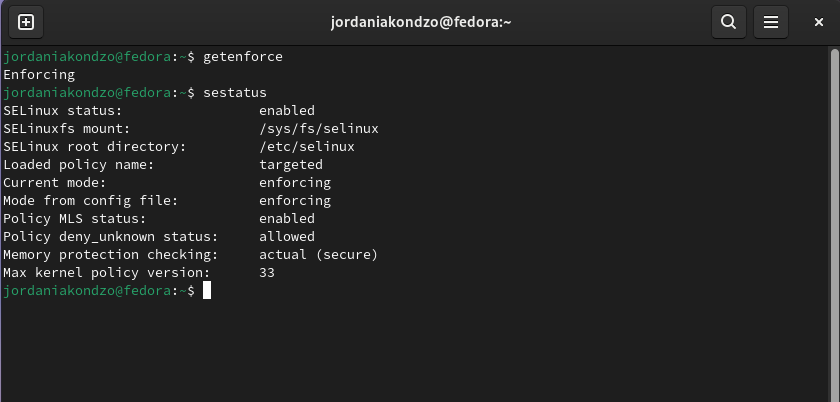{ #fig:001 width=70% }

* Результат показал, что система настроена корректно для выполнения лабораторной работы.

2. Настройка веб-сервера Apache

* После этого я убедился, что сервер Apache работает, используя команду: (рис. [-@fig:002])

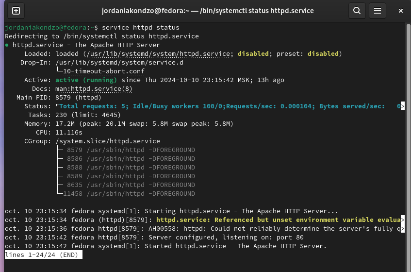{ #fig:002 width=70% }

3. Проверка контекста SELinux для Apache 

* Я проверил контексты безопасности для процессов Apache, используя команду: (рис. [-@fig:003])

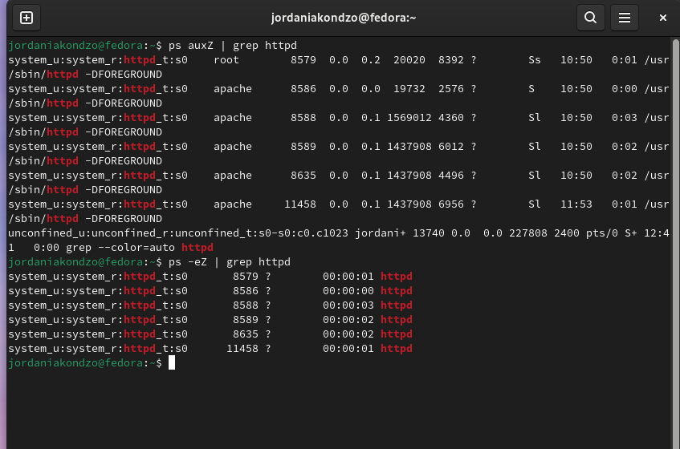{ #fig:003 width=70% }

* Эта команда показала, что процессы Apache работают с контекстом httpd_t, что позволяет серверу правильно обрабатывать веб-запросы.

4. Проверка текущих настроек SELinux для Apache 
* Далее, я использовал команду sestatus для проверки настроек SELinux, связанных с веб-сервером Apache: (рис. [-@fig:004])

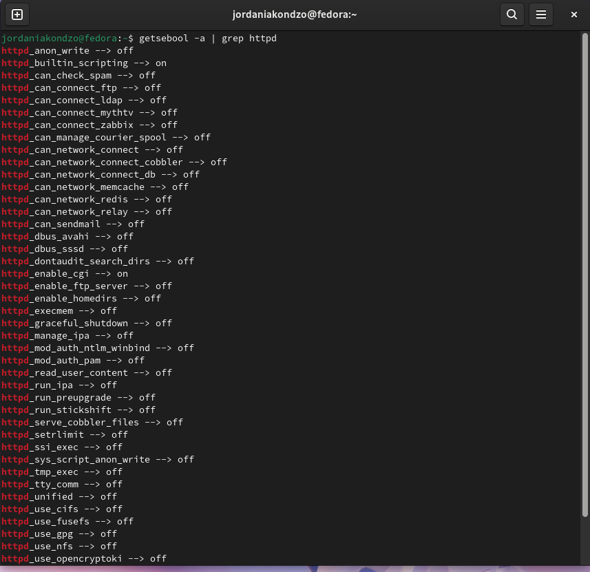{ #fig:004 width=70% }

* Это позволило мне увидеть, какие функции включены для Apache.

5. Анализ политик и типов SELinux
* Я также изучил статистику политик и список пользователей, ролей и типов, используя команду: (рис. [-@fig:005]) и (рис. [-@fig:006])

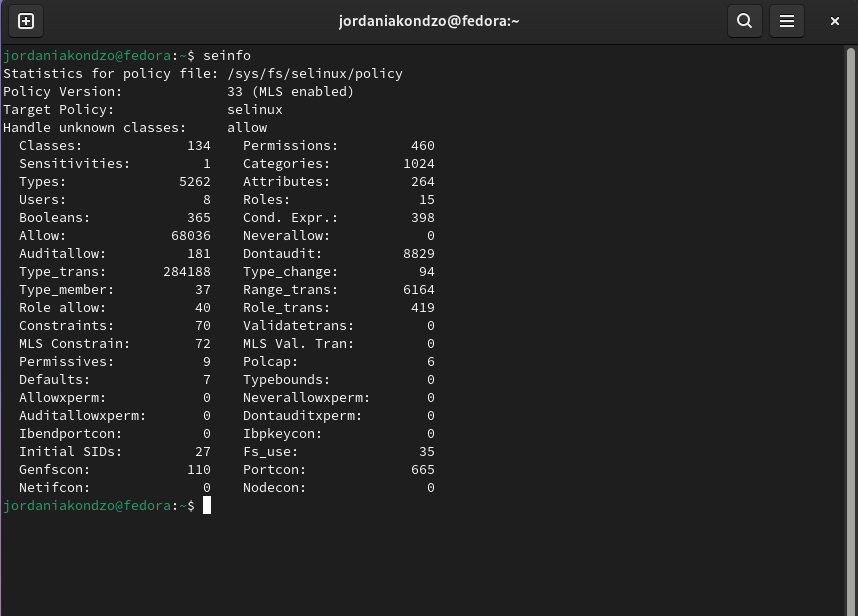{ #fig:005 width=70% }

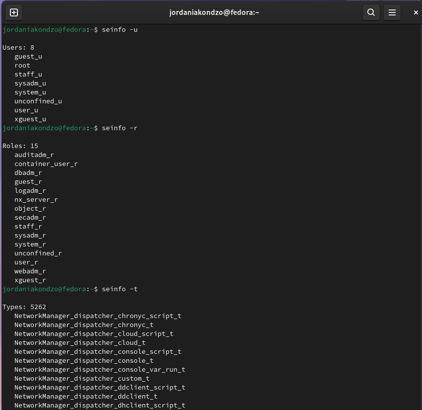{ #fig:006 width=70% }

* Это позволило мне получить полную картину того, как SELinux управляет доступом для Apache.

6. Определение типа файлов и поддиректорий, находящихся в директории `/var/www`, с помощью команды: (рис. [-@fig:007])

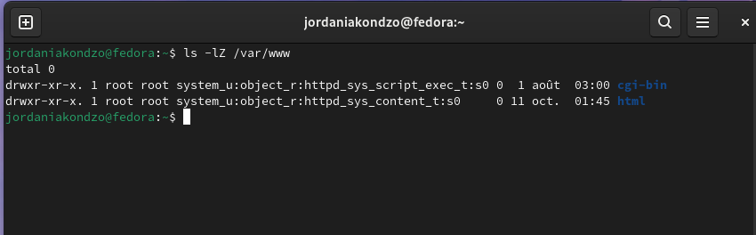{ #fig:007 width=70% }

7. Определение типа файлов, находящихся в директории ``/var/www/html`: (рис. [-@fig:008])

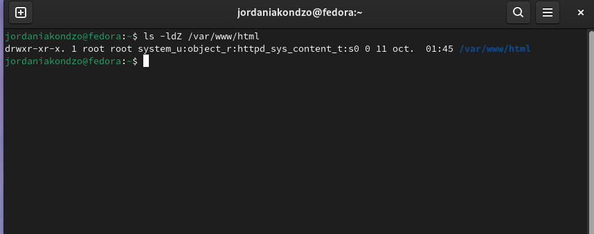{ #fig:008 width=70% }

8. Определение круга пользователей

* Я определил круг пользователей, которым разрешено создание файлов в директории **/var/www/html.** (рис. [-@fig:009])

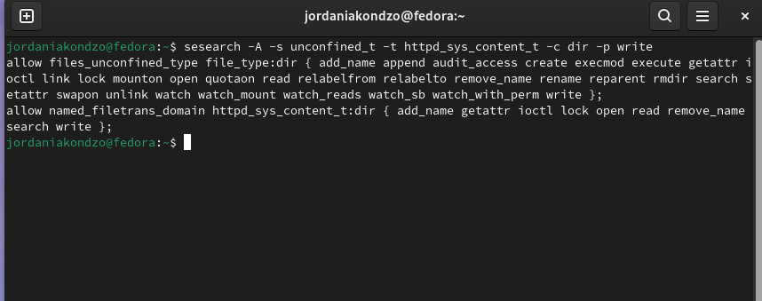{ #fig:009 width=70% }

9. Создание тестового файла и проверка доступа
* Я создал тестовый файл test.html в каталоге /var/www/html, используя команду: (рис. [-@fig:010])

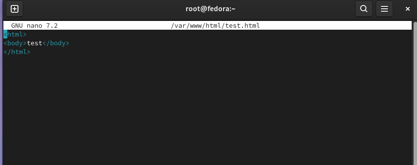{ #fig:010 width=70% }

* Содержание файла: (рис. [-@fig:011])

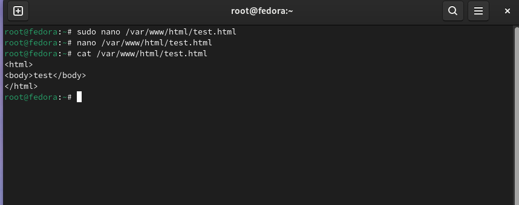{ #fig:011 width=70% }

10. Проверка контекста созданного файла
* Затем я проверил контекст этого файла командой: (рис. [-@fig:012])

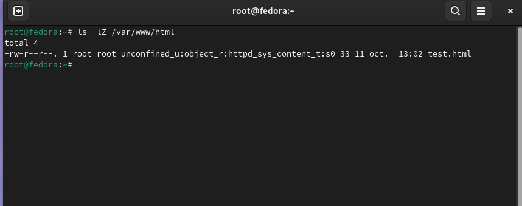{ #fig:012 width=70% }

* Контекст был установлен как httpd_sys_content_t, что позволило серверу Apache получить доступ к файлу через браузер.

11. Тестирование работы веб-сервера
* Я открыл браузер и перешел по адресу: (рис. [-@fig:013])

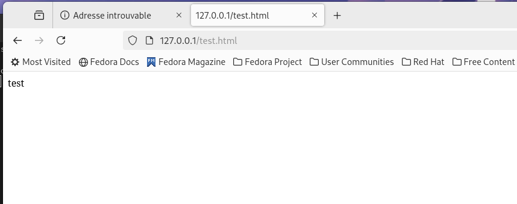{ #fig:013 width=70% }

* Файл успешно отобразился, что подтвердило правильность настроек SELinux для данного файла.

12. Анализ контекста файлов
* Я изучил контексты, определенные для файлов Apache. Контекст httpd_sys_content_t позволяет серверу Apache получать доступ к файлам, но не выполнять их или модифицировать без специальных разрешений. (рис. [-@fig:014])

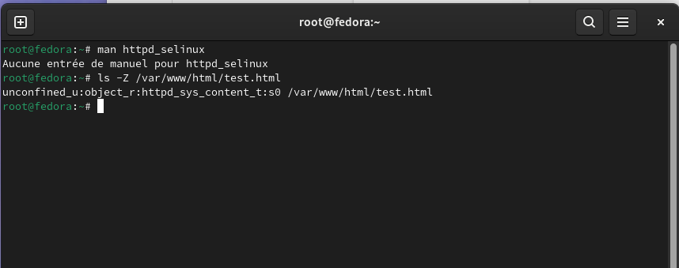{ #fig:014 width=70% }

13. Изменение контекста безопасности
* Я изменил контекст безопасности файла test.html на samba_share_t, чтобы проверить, как изменятся права доступа: (рис. [-@fig:015])

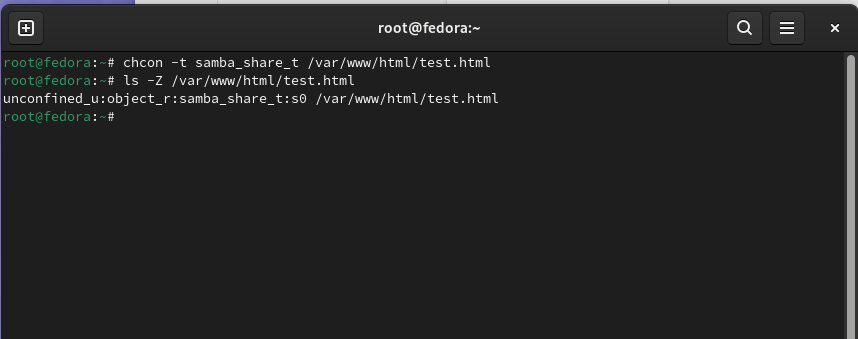{ #fig:015 width=70% }

14. Проверка блокировки доступа
* После изменения контекста на `samba_share_t`, я снова попытался открыть файл через браузер, но получил ошибку **403 Forbidden**. Это показало, что SELinux эффективно блокирует доступ к файлу с неподходящим контекстом. (рис. [-@fig:016]) 

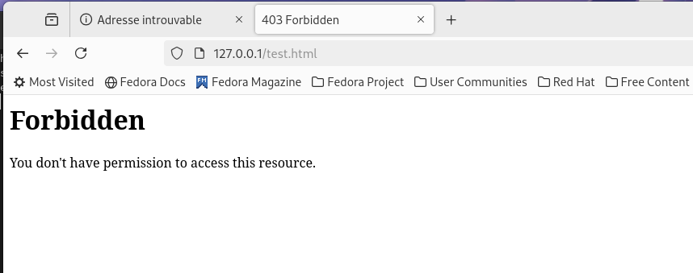{ #fig:016 width=70% }

* После этого проверил, что контекст поменялся.

15. Анализ ситуаций
* Я проанализировал ситуацию с помощью следующих команд: (рис. [-@fig:017])

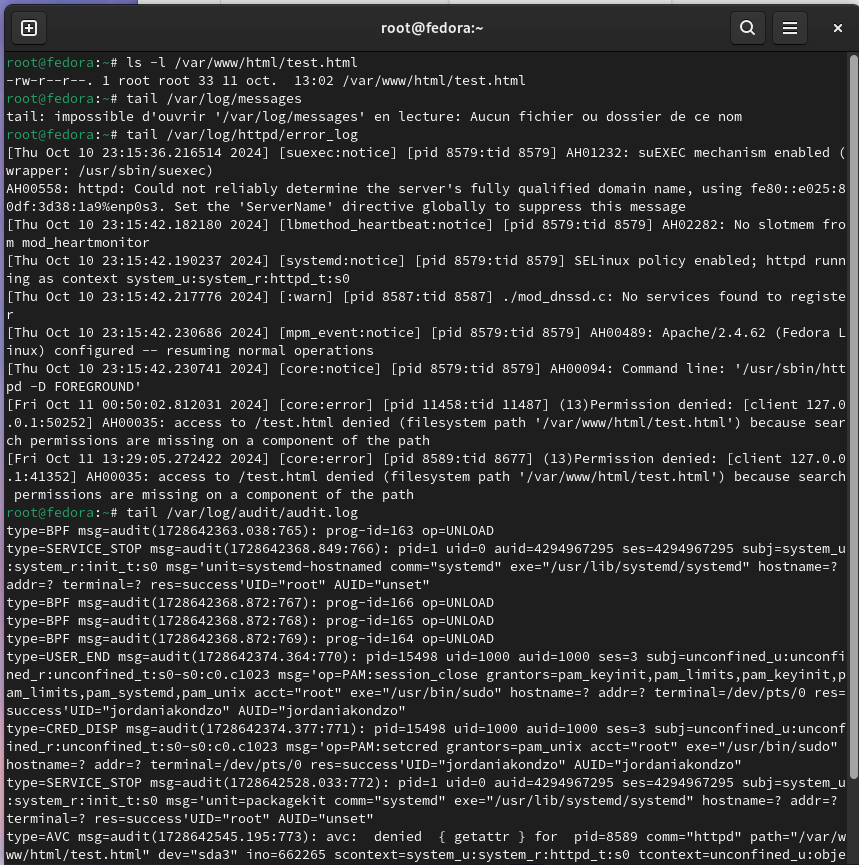{ #fig:017 width=70% }

* Анализ логов не выявил ошибок или предупреждений, связанных с перезапуском сервера.

16. Замение порта 80 на 81 для Apache в SELinux
* Попробовал запустить веб-сервер Apache на прослушивание ТСР-порта 81 (а не 80, как рекомендует IANA и прописано в /etc/services). Для этого в файле /etc/httpd/httpd.conf нашёл строчку Listen 80 и заменил её на Listen 81. (рис. [-@fig:018])

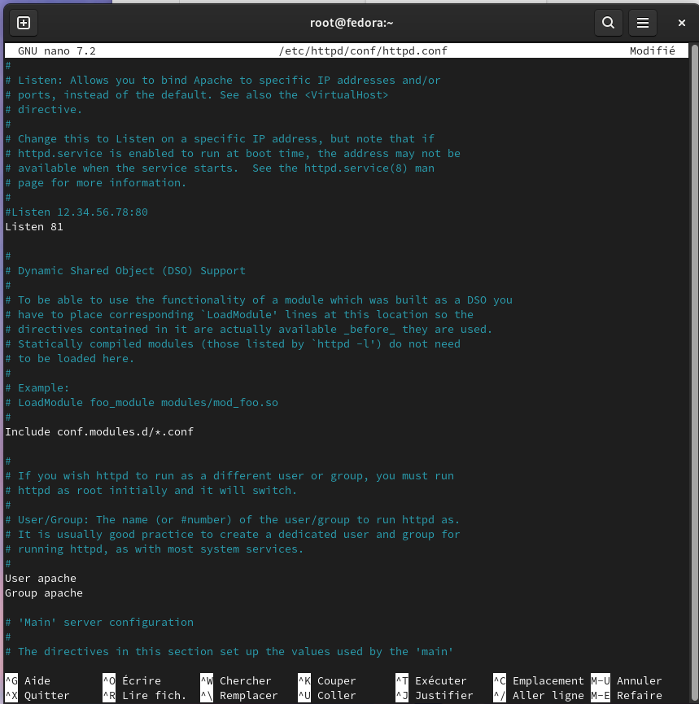{ #fig:018 width=70% }

17. Перезапуск веб-сервера Apache
* Я перезапустил сервер Apache с помощью команды: (рис. [-@fig:019])

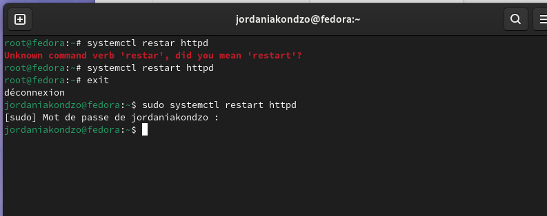{ #fig:019 width=70% }

* При перезапуске не возникло никаких сбоев, что подтвердило корректность конфигурации.

18. Анализ лог-файлов
* Я проанализировал лог-файлы с помощью следующих команд: (рис. [-@fig:020])

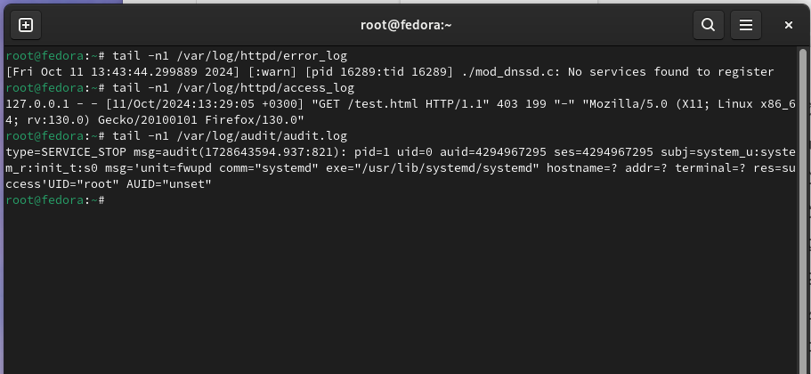{ #fig:020 width=70% }

19. Добавление порта 81 для Apache в SELinux
* Для добавления порта 81 я использовал команду: (рис. [-@fig:021])

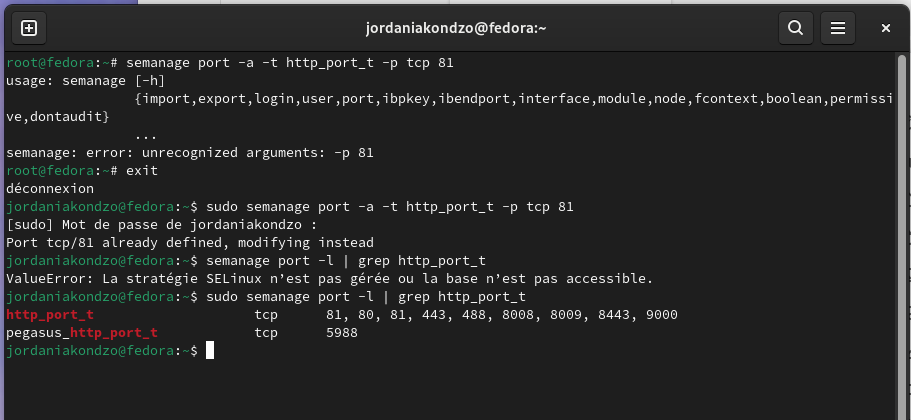{ #fig:021 width=70% }

* Это позволило серверу Apache работать на порту 81.

20. Проверка списка портов
* Я проверил, что порт 81 был успешно добавлен с помощью команды: (рис. [-@fig:022])

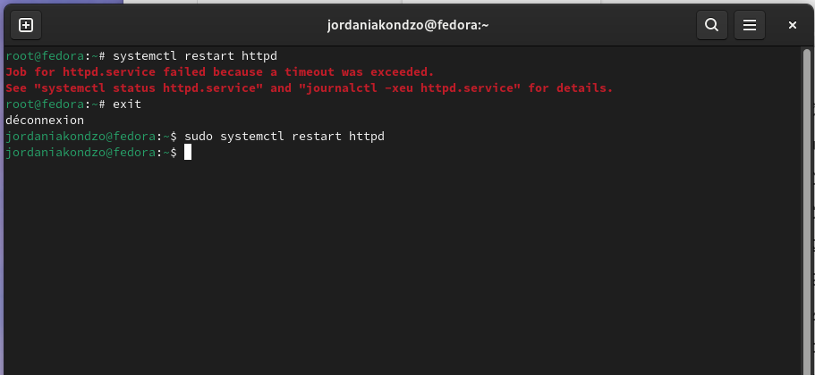{ #fig:022 width=70% }

* В выводе я увидел, что порты 80 и 81 доступны для Apache.

21. Перезапуск Apache
* Я перезапустил веб-сервер Apache, чтобы изменения вступили в силу: (рис. [-@fig:023])

* Файл **test.html** успешно отобразился, что подтвердило работу Apache на новом порту 81.

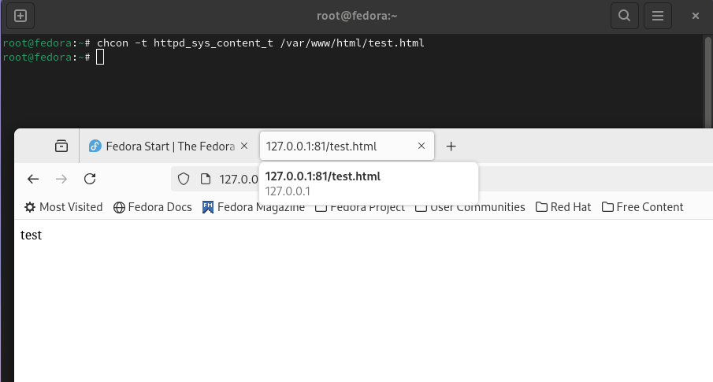{ #fig:023 width=70% }

22. Вернул контекст `httpd_sys_cоntent__t` к файлу **/var/www/html/ test.html**: (рис. [-@fig:024])

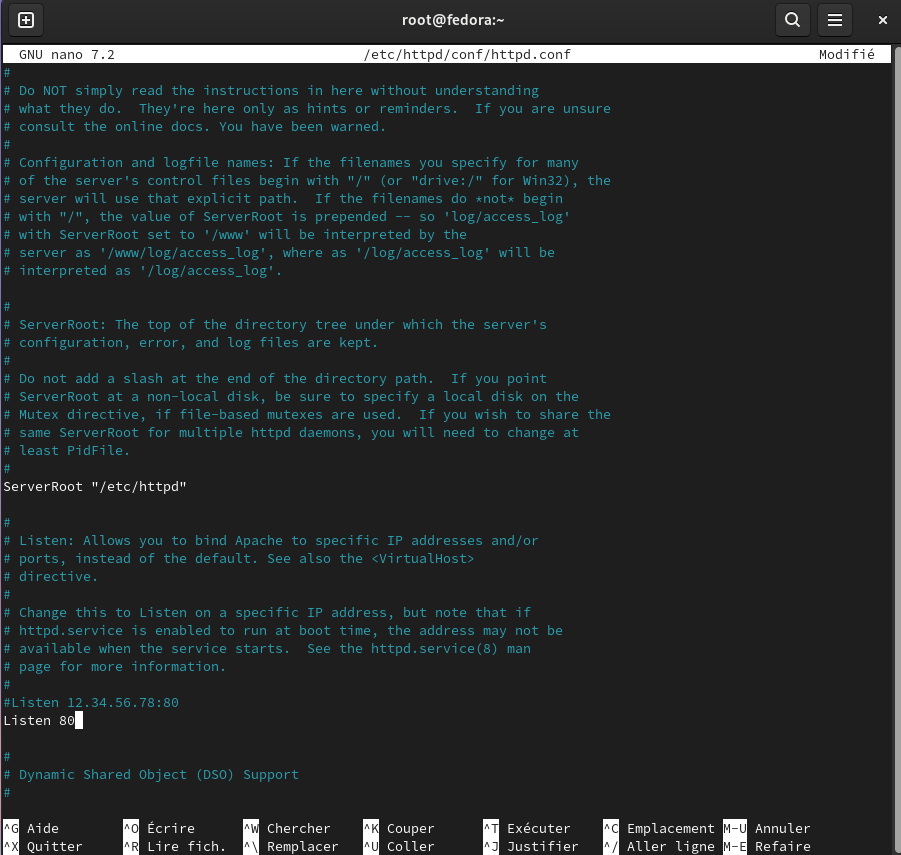{ #fig:024 width=70% }

23. Удаление привязки порта 81 к Apache
* После успешного тестирования я удалил порт 81 из списка разрешенных для SELinux с помощью команды: (рис. [-@fig:025])

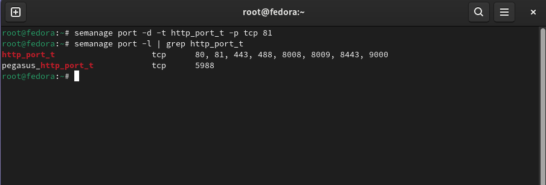{ #fig:025 width=70% }

24. Удаление тестового файла
* Я удалил тестовый файл test.html с помощью команды: (рис. [-@fig:026])

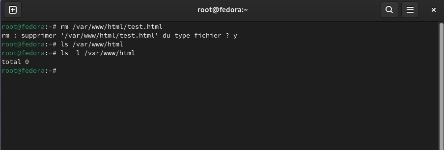{ #fig:026 width=70% }

# Выводы

В ходе лабораторной работы я приобрел практические навыки работы с SELinux в связке с веб-сервером Apache. Я научился настраивать контексты безопасности для файлов и управлять портами, используя SELinux для обеспечения мандатного контроля доступа. Работая с различными контекстами, такими как httpd_sys_content_t и samba_share_t, я увидел, как SELinux блокирует несанкционированный доступ, что помогает значительно повысить безопасность системы.

