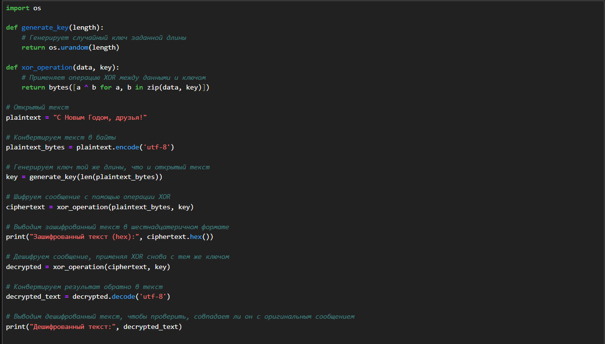
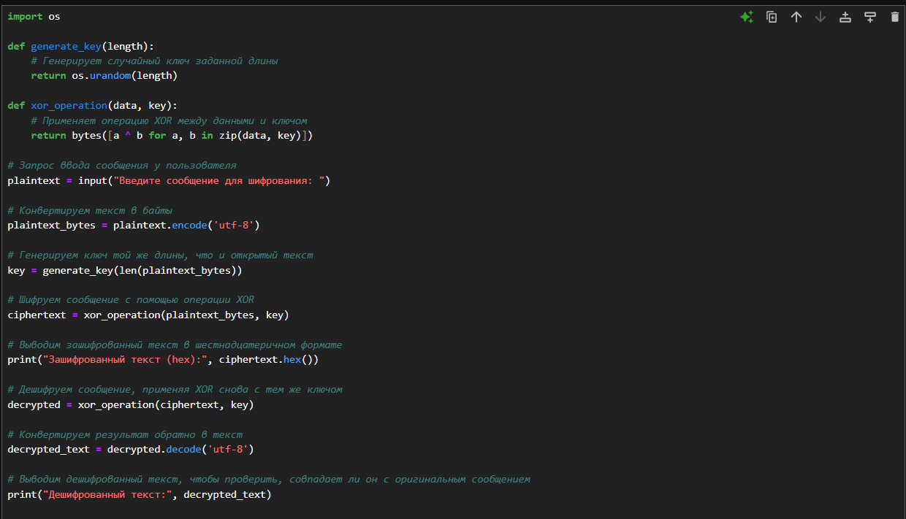
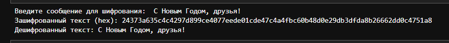

---
## Front matter
title: "Oтчёта по лабораторной работе №7"
subtitle: "Элементы криптографии. Однократное гаммирование"
author: "Акондзо Жордани Лади Гаэл"

## Generic otions
lang: ru-RU
toc-title: "Содержание"

## Bibliography
bibliography: bib/cite.bib
csl: pandoc/csl/gost-r-7-0-5-2008-numeric.csl

## Pdf output format
toc: true # Table of contents
toc-depth: 2
lof: true # List of figures
lot: true # List of tables
fontsize: 12pt
linestretch: 1.5
papersize: a4
documentclass: scrreprt
## I18n polyglossia
polyglossia-lang:
  name: russian
  options:
	- spelling=modern
	- babelshorthands=true
polyglossia-otherlangs:
  name: english
## I18n babel
babel-lang: russian
babel-otherlangs: english
## Fonts
mainfont: PT Serif
romanfont: PT Serif
sansfont: PT Sans
monofont: PT Mono
mainfontoptions: Ligatures=TeX
romanfontoptions: Ligatures=TeX
sansfontoptions: Ligatures=TeX,Scale=MatchLowercase
monofontoptions: Scale=MatchLowercase,Scale=0.9
## Biblatex
biblatex: true
biblio-style: "gost-numeric"
biblatexoptions:
  - parentracker=true
  - backend=biber
  - hyperref=auto
  - language=auto
  - autolang=other*
  - citestyle=gost-numeric
## Pandoc-crossref LaTeX customization
figureTitle: "Рис."
lofTitle: "Список иллюстраций"
## Misc options
indent: true
header-includes:
  - \usepackage{indentfirst}
  - \usepackage{float} # keep figures where there are in the text
  - \floatplacement{figure}{H} # keep figures where there are in the text
---

# Цель работы

* Цель данной лабораторной работы — изучение метода однократного гаммирования для шифрования и дешифрования данных.

# Теоретическое введение

* Однократное гаммирование (шифр Вернама) — это метод симметричного шифрования, при котором каждое сообщение шифруется с помощью ключа, длина которого совпадает с длиной сообщения. Шифрование и дешифрование происходит с использованием операции побитового исключающего ИЛИ (XOR) между символами ключа и открытого текста. Преимущество однократного гаммирования заключается в его абсолютной криптостойкости, если ключ используется только один раз и является абсолютно случайным.

# Выполнение лабораторной работы

## Первый вариант программы: фиксированное сообщение для шифрования

* Первый вариант программы реализует шифрование фиксированного сообщения «С Новым Годом, друзья!», ключ для которого генерируется случайно. Этот пример наглядно демонстрирует работу операции XOR для шифрования и последующего дешифрования. (рис. [-@fig:001])

{ #fig:001 width=70% }

## КОД1:

```
import os

def generate_key(length):
    # Генерирует случайный ключ заданной длины
    return os.urandom(length)

def xor_operation(data, key):
    # Применяет операцию XOR между данными и ключом
    return bytes([a ^ b for a, b in zip(data, key)])

# Открытый текст
plaintext = "С Новым Годом, друзья!"

# Конвертируем текст в байты
plaintext_bytes = plaintext.encode('utf-8')

# Генерируем ключ той же длины, что и открытый текст
key = generate_key(len(plaintext_bytes))

# Шифруем сообщение с помощью операции XOR
ciphertext = xor_operation(plaintext_bytes, key)

# Выводим зашифрованный текст в шестнадцатеричном формате
print("Зашифрованный текст (hex):", ciphertext.hex())

# Дешифруем сообщение, применяя XOR снова с тем же ключом
decrypted = xor_operation(ciphertext, key)

# Конвертируем результат обратно в текст
decrypted_text = decrypted.decode('utf-8')

# Выводим дешифрованный текст, чтобы проверить, совпадает ли он с оригинальным сообщением
print("Дешифрованный текст:", decrypted_text)

```

## Описание работы программы 1:

1. Генерация ключа: Программа генерирует случайный ключ с помощью функции `os.urandom()`, который соответствует длине открытого текста.
2. Шифрование: С помощью операции XOR каждый байт открытого текста комбинируется с соответствующим байтом ключа.
3. Дешифрование: Повторное применение операции XOR с тем же ключом позволяет восстановить исходный текст.

## Результат_1: 

* Зашифрованный текст выводится в шестнадцатеричном формате.
* Дешифрованный текст полностью совпадает с исходным.
(рис. [-@fig:002])

{ #fig:002 width=70% }

##  Второй вариант программы: ввод текста пользователем

* Во втором варианте программы пользователю предоставляется возможность ввести любое сообщение для шифрования. Программа генерирует ключ и выводит зашифрованный и дешифрованный текст. (рис. [-@fig:003])

{ #fig:003 width=70% }

## КОД2:

```
import os

def generate_key(length):
    # Генерирует случайный ключ заданной длины
    return os.urandom(length)

def xor_operation(data, key):
    # Применяет операцию XOR между данными и ключом
    return bytes([a ^ b for a, b in zip(data, key)])

# Запрос ввода сообщения у пользователя
plaintext = input("Введите сообщение для шифрования: ")

# Конвертируем текст в байты
plaintext_bytes = plaintext.encode('utf-8')

# Генерируем ключ той же длины, что и открытый текст
key = generate_key(len(plaintext_bytes))

# Шифруем сообщение с помощью операции XOR
ciphertext = xor_operation(plaintext_bytes, key)

# Выводим зашифрованный текст в шестнадцатеричном формате
print("Зашифрованный текст (hex):", ciphertext.hex())

# Дешифруем сообщение, применяя XOR снова с тем же ключом
decrypted = xor_operation(ciphertext, key)

# Конвертируем результат обратно в текст
decrypted_text = decrypted.decode('utf-8')

# Выводим дешифрованный текст, чтобы проверить, совпадает ли он с оригинальным сообщением
print("Дешифрованный текст:", decrypted_text)

```

## Описание работы программы 2:

1. Ввод сообщения: Пользователь вводит любое сообщение, которое будет зашифровано.
2. Генерация ключа: Ключ генерируется случайным образом и имеет ту же длину, что и введённое сообщение.
3. Шифрование и дешифрование: Программа выполняет шифрование и дешифрование с помощью операции XOR.

## Результат_2: 

* Программа позволяет шифровать и дешифровать любое сообщение, введённое пользователем.
* Зашифрованный текст выводится в виде шестнадцатеричных символов, что упрощает его анализ.
* Дешифрованный текст восстанавливается полностью и совпадает с введённым пользователем.
(рис. [-@fig:004]) и (рис. [-@fig:005])

{ #fig:004 width=70% }

{ #fig:005 width=70% }

# Выводы

В ходе выполнения лабораторной работы были созданы два варианта программы для однократного гаммирования. В первом случае программа демонстрировала шифрование фиксированного текста, а во втором случае пользователь мог вводить любое сообщение для шифрования. Оба варианта программы успешно продемонстрировали работу метода однократного гаммирования, а также его основное преимущество — невозможность восстановления исходного текста без знания ключа.
