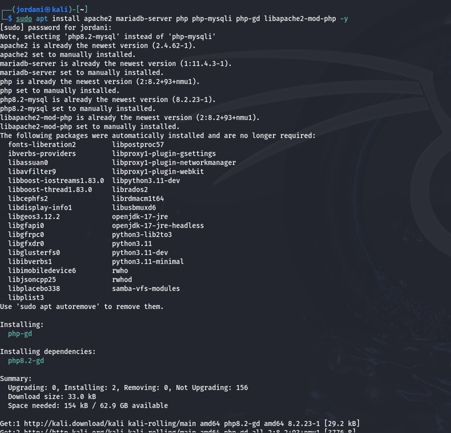
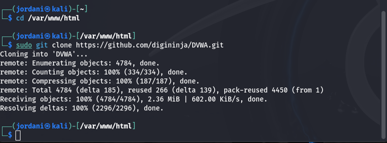
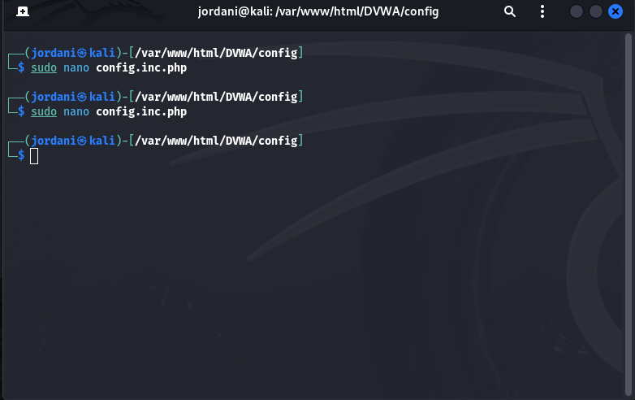
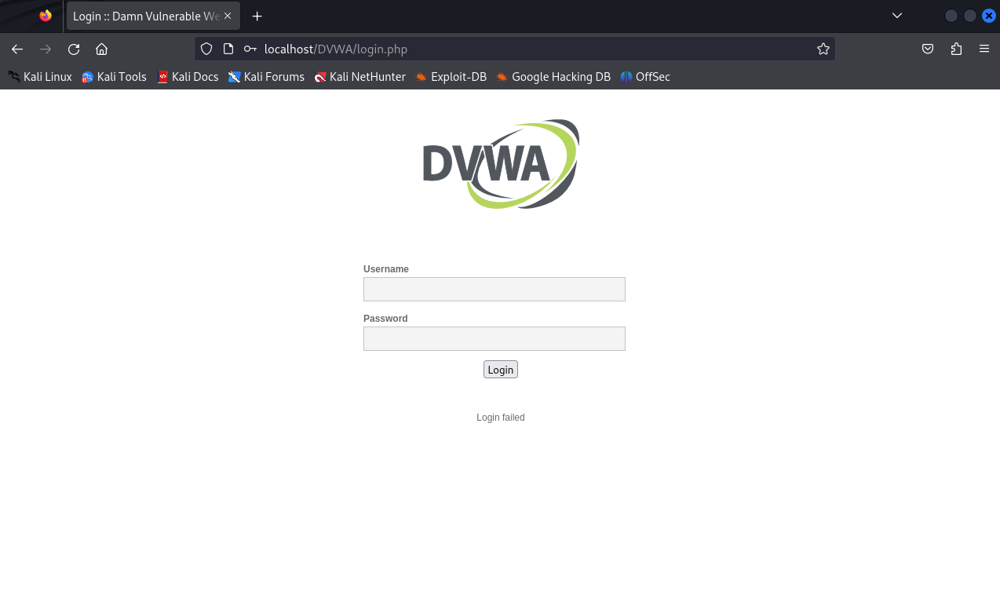
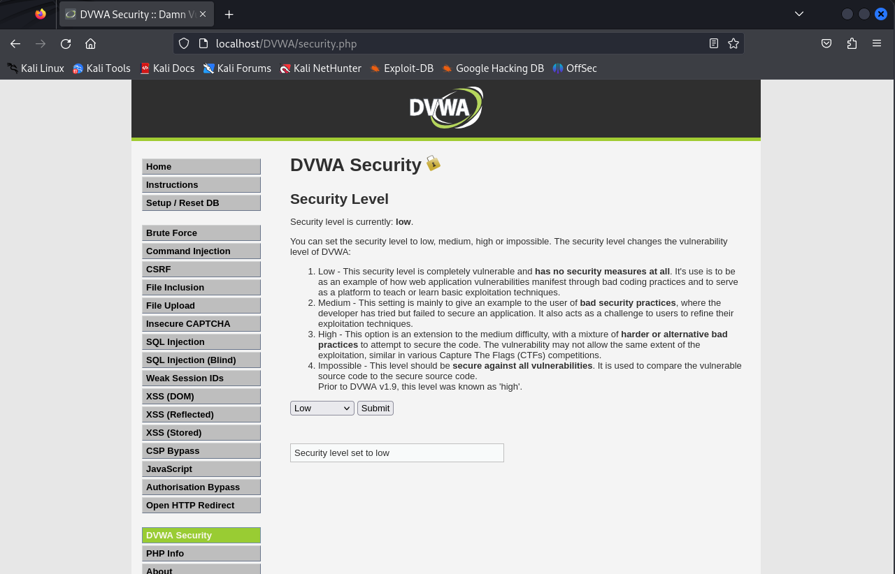
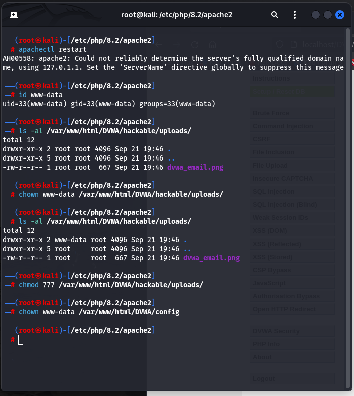

---
## Front matter
lang: ru-RU
title: Презентация о выполнении индивидуальный проект Этап 2
subtitle: Информационная безопасность
author:
  - Акондзо Жордани Лади Гаэл.
institute:
  - Российский университет дружбы народов, Москва, Россия
date: 21 сентября 2024

## i18n babel
babel-lang: russian
babel-otherlangs: english

## Formatting pdf
toc: false
toc-title: Содержание
slide_level: 2
aspectratio: 169
section-titles: true
theme: metropolis
header-includes:
 - \metroset{progressbar=frametitle,sectionpage=progressbar,numbering=fraction}
 - '\makeatletter'
 - '\beamer@ignorenonframefalse'
 - '\makeatother'
---

# Информация

## Докладчик

:::::::::::::: {.columns align=center}
::: {.column width="70%"}

  * Акондзо Жордани Лади Гаэл.
  * студент 4-го курса группы НКНбд-01-21
  * 1032215649
  * Российский университет дружбы народов
  * [GitHub](https://github.com/Jordaniakondzo)

:::
::::::::::::::

# Вводная часть

# Цель работы

Научиться основным способам тестирования веб приложений

# Задание
* Найти максимальное количество уязвимостей различных типов.
* Реализовать успешную эксплуатацию каждой уязвимости.


# Выполнение лабораторной работы

## Установка необходимых зависимостей 
* DVWA требует наличия некоторых зависимостей для работы, таких как Apache, MariaDB (или MySQL), PHP и несколько модулей PHP.



## Запуск служб Apache и MariaDB
* Убедился, что службы Apache и MariaDB запущены.


* Чтобы эти службы запускались автоматически при старте системы, выполнил следующие команды.


## Настройка MariaDB
* Подключусь к MariaDB для создания базы данных и пользователя для DVWA. Потом в командной строке MariaDB выполнил следующие команды.


## Загрузка и настройка DVWA
* Скачайл последнюю версию DVWA из репозитория GitHub.



* Потом создал файл конфигурации для DVWA .


* Открыл этот файл для редактирования и внёс изменения в информацию о базе данных .




## Завершение установки DVWA
* Потос открыл браузер и перешёл по адресу: http://localhost/DVWA/setup.php. Следовал инструкциям на странице для завершения установки. По окончании установки, вошёл в DVWA, используя следующие данные для входа:

```
 Логин: admin
 Пароль: password 
```



## Окончательная настройка

* **Проверка настроек базы данных (Setup Check)**.


* **Уровень безопасности DVWA:** Протестировал несколько уровней безопасности, начиная с Impossible, где все уязвимости заблокированы, и продолжив с Low, который позволяет изучать наиболее распространенные уязвимости без каких-либо мер безопасности.




* **Изменения в файле php.ini:** Параметры *allow_url_fopen = On и allow_url_include = On* были включены, что важно для тестирования уязвимостей, связанных с включением локальных или удалённых файлов **(LFI/RFI)**.





# Выводы

На этом этапе я научился устанавливать и настраивать DVWA на Kali Linux. Я освоил конфигурацию баз данных, работу с Apache и MariaDB, а также внес необходимые изменения в настройки PHP для тестирования уязвимостей. Изучение разных уровней безопасности в DVWA позволило понять, как плохие практики разработки делают приложения уязвимыми для атак.
