---
## Front matter
title: "Отчёт о выполнении индивидуальный проект Этап 2"
subtitle: "Установка DVWA"
author: "Акондзо Жордани Лади Гаэл"

## Generic otions
lang: ru-RU
toc-title: "Содержание"

## Bibliography
bibliography: bib/cite.bib
csl: pandoc/csl/gost-r-7-0-5-2008-numeric.csl

## Pdf output format
toc: true # Table of contents
toc-depth: 2
lof: true # List of figures
lot: true # List of tables
fontsize: 12pt
linestretch: 1.5
papersize: a4
documentclass: scrreprt
## I18n polyglossia
polyglossia-lang:
  name: russian
  options:
	- spelling=modern
	- babelshorthands=true
polyglossia-otherlangs:
  name: english
## I18n babel
babel-lang: russian
babel-otherlangs: english
## Fonts
mainfont: PT Serif
romanfont: PT Serif
sansfont: PT Sans
monofont: PT Mono
mainfontoptions: Ligatures=TeX
romanfontoptions: Ligatures=TeX
sansfontoptions: Ligatures=TeX,Scale=MatchLowercase
monofontoptions: Scale=MatchLowercase,Scale=0.9
## Biblatex
biblatex: true
biblio-style: "gost-numeric"
biblatexoptions:
  - parentracker=true
  - backend=biber
  - hyperref=auto
  - language=auto
  - autolang=other*
  - citestyle=gost-numeric
## Pandoc-crossref LaTeX customization
figureTitle: "Рис."
lofTitle: "Список иллюстраций"
## Misc options
indent: true
header-includes:
  - \usepackage{indentfirst}
  - \usepackage{float} # keep figures where there are in the text
  - \floatplacement{figure}{H} # keep figures where there are in the text
---

# Цель работы

Научиться основным способам тестирования веб приложений

# Задание
* Найти максимальное количество уязвимостей различных типов.
* Реализовать успешную эксплуатацию каждой уязвимости.


# Выполнение лабораторной работы

## Установка необходимых зависимостей 
* DVWA требует наличия некоторых зависимостей для работы, таких как Apache, MariaDB (или MySQL), PHP и несколько модулей PHP (рис. [-@fig:001]).

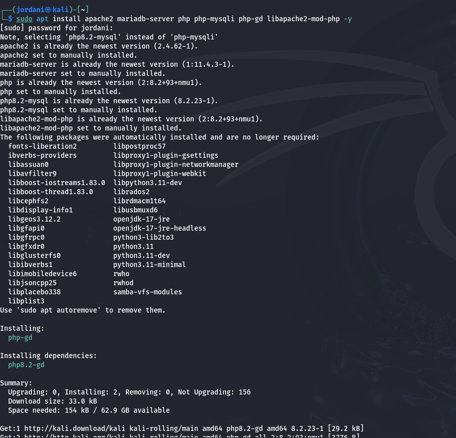{ #fig:001 width=70% }

## Запуск служб Apache и MariaDB
* Убедился, что службы Apache и MariaDB запущены (рис. [-@fig:002]).

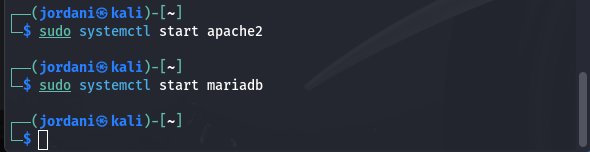{ #fig:002 width=70% }

* Чтобы эти службы запускались автоматически при старте системы, выполнил следующие команды (рис. [-@fig:003]).

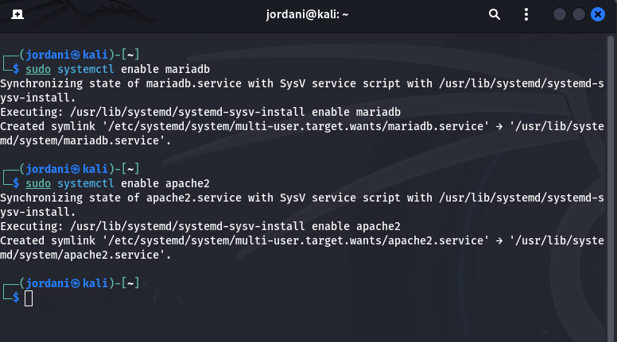{ #fig:003 width=70% }

## Настройка MariaDB
* Подключусь к MariaDB для создания базы данных и пользователя для DVWA. Потом в командной строке MariaDB выполнил следующие команды  (рис. [-@fig:004]).

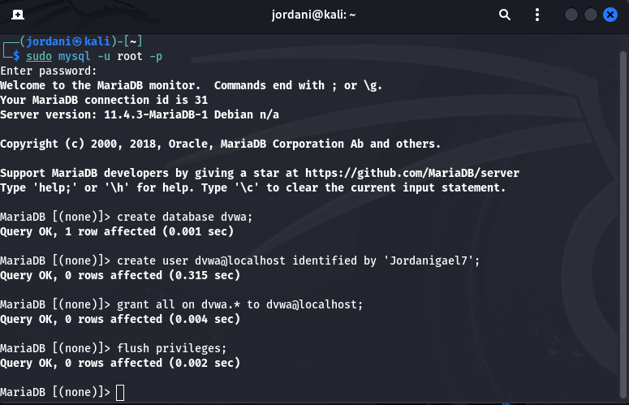{ #fig:004 width=70% }


## Загрузка и настройка DVWA
* Скачайл последнюю версию DVWA из репозитория GitHub (рис. [-@fig:005]).

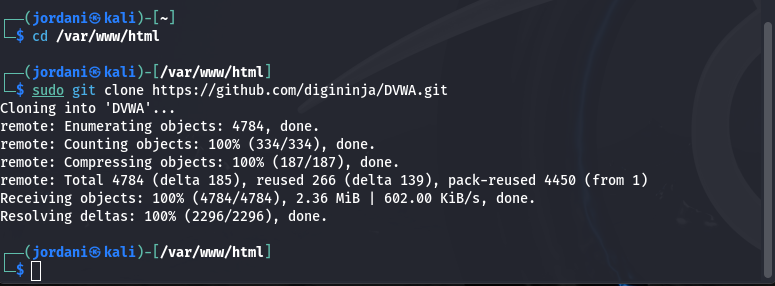{ #fig:005 width=70% }

* Потом создал файл конфигурации для DVWA (рис. [-@fig:006]).

{ #fig:006 width=70% }

* Открыл этот файл для редактирования и внёс изменения в информацию о базе данных (рис. [-@fig:007]) и (рис. [-@fig:008]).

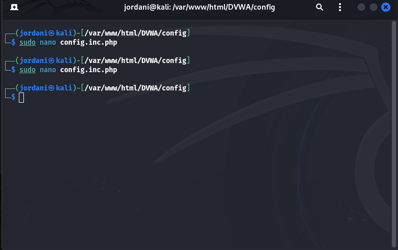{ #fig:008 width=70% }

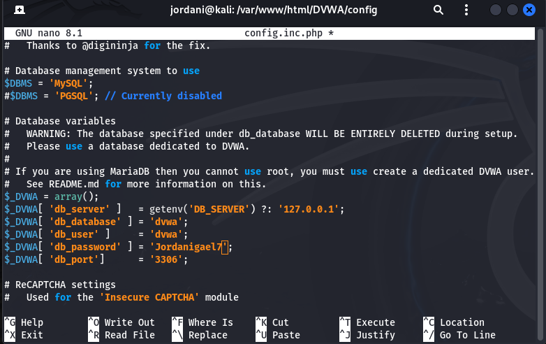{ #fig:007 width=70% }

## Завершение установки DVWA
* Потос открыл браузер и перешёл по адресу: http://localhost/DVWA/setup.php. Следовал инструкциям на странице для завершения установки. По окончании установки, вошёл в DVWA, используя следующие данные для входа (рис. [-@fig:009]):

```
 Логин: admin
 Пароль: password 
```

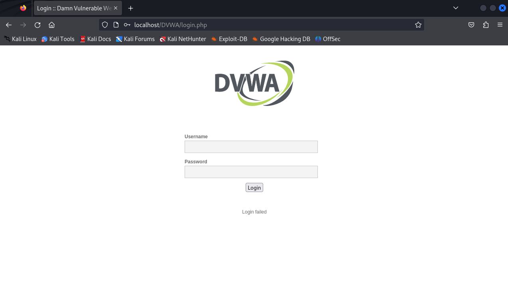{ #fig:009 width=70% }

## Окончательная настройка

* **Проверка настроек базы данных (Setup Check)** (рис. [-@fig:010]).

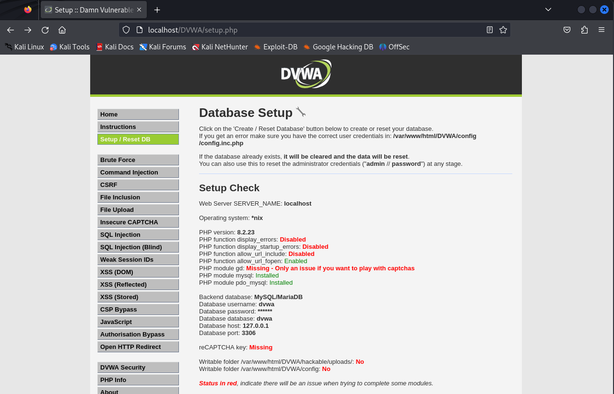{ #fig:010 width=70% }

* **Уровень безопасности DVWA:** Протестировал несколько уровней безопасности, начиная с Impossible, где все уязвимости заблокированы, и продолжив с Low, который позволяет изучать наиболее распространенные уязвимости без каких-либо мер безопасности (рис. [-@fig:011]) и (рис. [-@fig:012]).

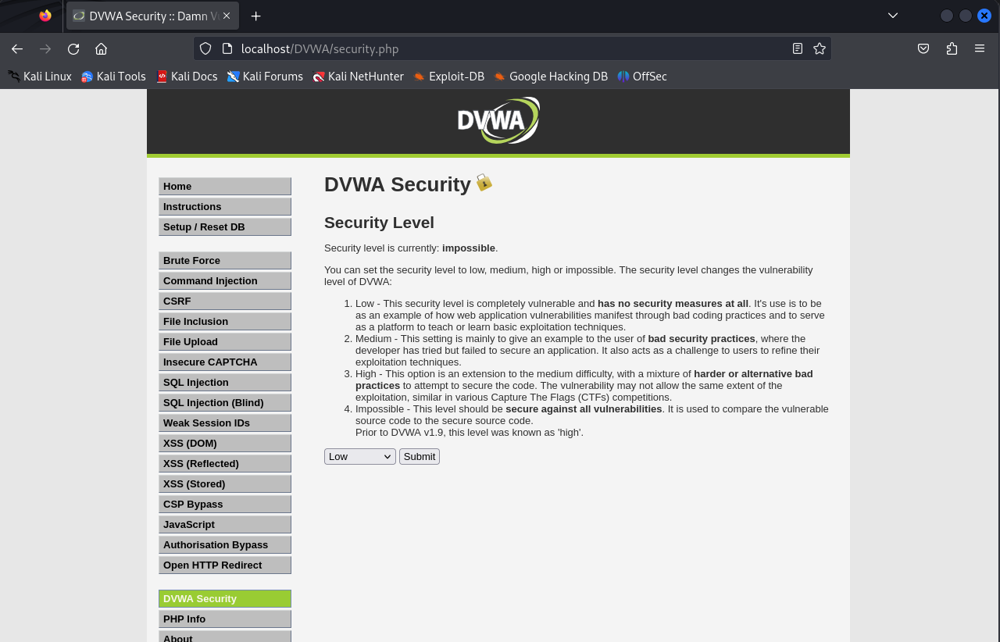{ #fig:011 width=70% }

{ #fig:012 width=70% }

* **Изменения в файле php.ini:** Параметры *allow_url_fopen = On и allow_url_include = On* были включены, что важно для тестирования уязвимостей, связанных с включением локальных или удалённых файлов **(LFI/RFI)** (рис. [-@fig:013]), (рис. [-@fig:014]) и (рис. [-@fig:015]).

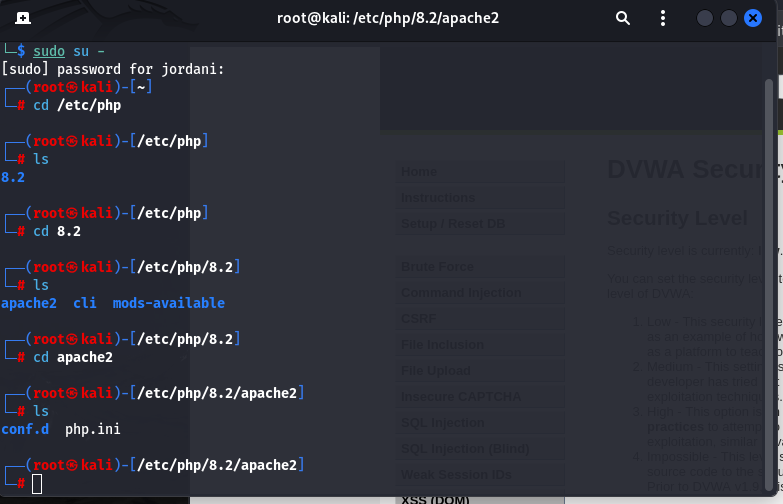{ #fig:013 width=70% }

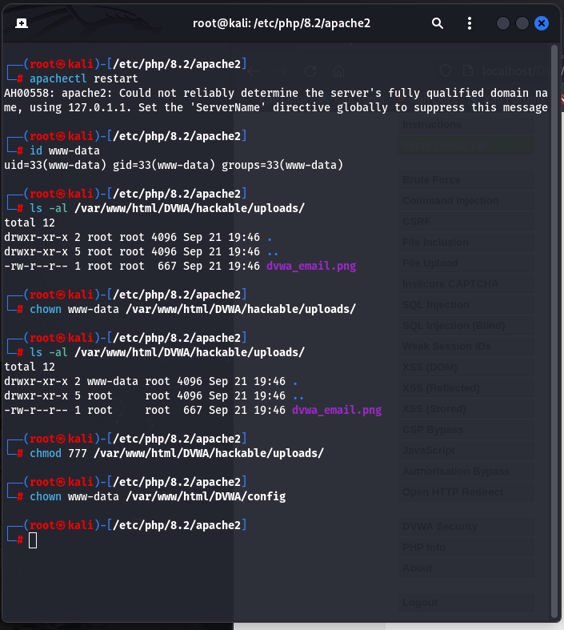{ #fig:014 width=70% }

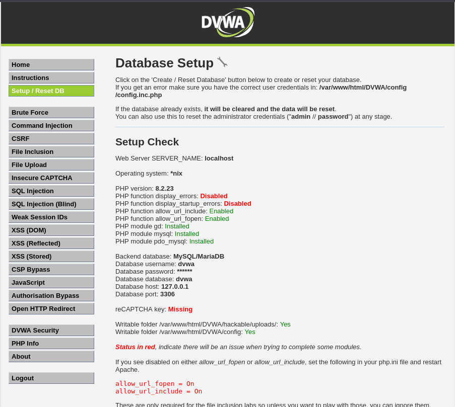{ #fig:015 width=70% }

# Выводы

На этом этапе я научился устанавливать и настраивать DVWA на Kali Linux. Я освоил конфигурацию баз данных, работу с Apache и MariaDB, а также внес необходимые изменения в настройки PHP для тестирования уязвимостей. Изучение разных уровней безопасности в DVWA позволило понять, как плохие практики разработки делают приложения уязвимыми для атак.

