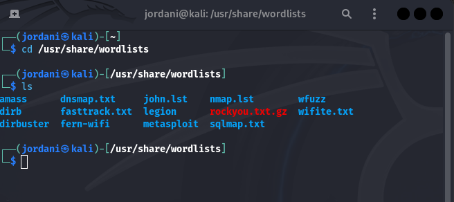
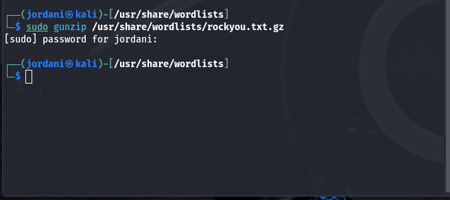
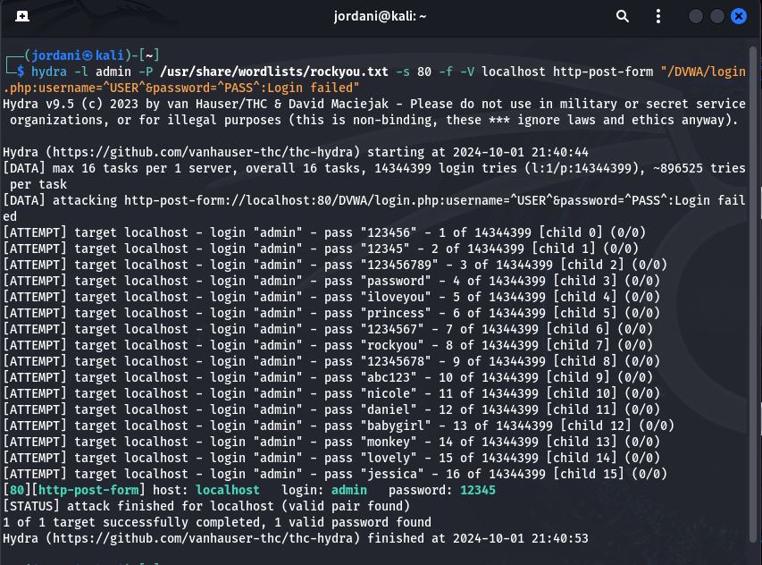
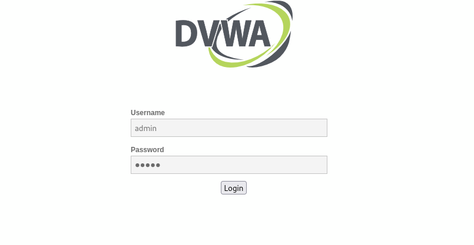
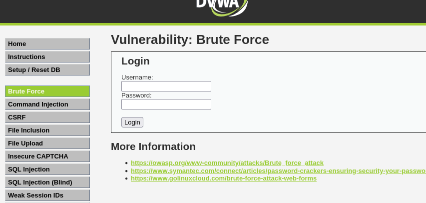
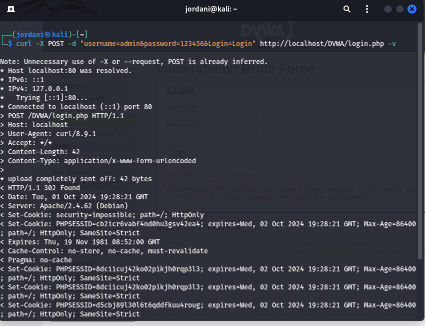

---
## Front matter
lang: ru-RU
title: Презентация о выполнении индивидуальный проект Этап 3
subtitle: Информационная безопасность
author:
  - Акондзо Жордани Лади Гаэл.
institute:
  - Российский университет дружбы народов, Москва, Россия
date: 26 сентября 2024

## i18n babel
babel-lang: russian
babel-otherlangs: english

## Formatting pdf
toc: false
toc-title: Содержание
slide_level: 2
aspectratio: 169
section-titles: true
theme: metropolis
header-includes:
 - \metroset{progressbar=frametitle,sectionpage=progressbar,numbering=fraction}
 - '\makeatletter'
 - '\beamer@ignorenonframefalse'
 - '\makeatother'
---

# Информация

## Докладчик

:::::::::::::: {.columns align=center}
::: {.column width="70%"}

  * Акондзо Жордани Лади Гаэл.
  * студент 4-го курса группы НКНбд-01-21
  * 1032215649
  * Российский университет дружбы народов
  * [GitHub](https://github.com/Jordaniakondzo)

:::
::::::::::::::

# Цель работы

Научиться основным способам тестирования веб приложений

# Задание
* Найти максимальное количество уязвимостей различных типов.
* Реализовать успешную эксплуатацию каждой уязвимости.

# Теоретическое введение

**Hydra** — это мощный инструмент для атаки методом перебора (грубой силы) на различные сервисы, включая веб-формы HTTP. В этом этапе мы будем использовать Hydra для проверки безопасности формы аутентификации в приложении **DVWA**.

# Выполнение лабораторной работы

## Подготовка: Список Паролей
* Для выполнения атаки Hydra необходим список паролей: 
* **rockyou.txt** — один из самых популярных списков паролей в Kali Linux:



* Сначала распаковал файл:



## Команда Hydra для Атаки на HTTP Форму
* Для выполнения атаки на форму аутентификации DVWA использовал следующую команду:



## Пояснение аргументов:
* -l admin: Имя пользователя для атаки (в данном случае — "admin").
* -P /usr/share/wordlists/rockyou.txt: Файл со списком паролей.
* -s 80: Порт, на котором работает веб-сервис (обычно порт 80).
* -f: Остановить атаку после нахождения правильной комбинации.
* -V: Подробный режим, отображающий каждую попытку.
* localhost: Адрес сервера (в данном случае — локально установленное DVWA).
* http-post-form: Указывает, что это форма HTTP, использующая метод POST.
* "/DVWA/login.php:username=^USER^&password=^PASS^:Login failed":
    * Путь к форме.
    * Шаблон для отправки имени пользователя и пароля.
    * Строка "Login failed" как индикатор неудачной попытки.

## Анализ Результатов

* После выполнения команды Hydra получим результат, который может выглядеть так:

```
[80][http-post-form] host: localhost   login: admin   password: 12345
[STATUS] attack finished for localhost (valid pair found)

```

### Проверка Найденного Пароля

* Чтобы убедиться, что найденная комбинация действительно работает, выполнил следующие действия:

   * Ручная проверка:

     * Открыл браузер и перешёл на страницу входа в DVWA: http://localhost/DVWA/login.php.
     * Ввел имя пользователя admin и пароль 12345.
     * Если вход выполнен успешно, это подтверждает, что Hydra нашла правильный пароль.





   * Проверка с помощью curl:
     * Можно тоже использовать команду curl, чтобы проверить результаты в терминале
     ```
     curl -X POST -d "username=admin&password=12345&Login=Login" http://localhost/DVWA/login.php -v

     ```



  * Команда -v покажет ответ сервера, что поможет подтвердить успешность аутентификации.

# Выводы

На этом этапе я научилисся использовать **Hydra** для атаки методом грубой силы на форму входа в **DVWA** и проверять результаты атаки. Этот опыт демонстрирует, насколько важно использовать сложные пароли, чтобы предотвратить подобные атаки, и показывает, как инструменты автоматизации могут быть использованы злоумышленниками для нахождения слабых мест в системе безопасности.
