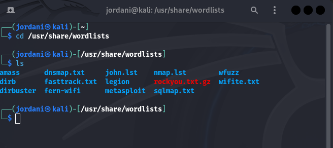
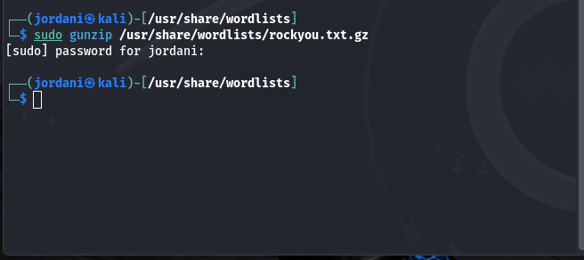
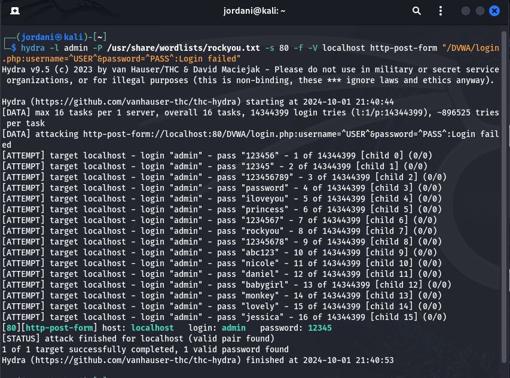
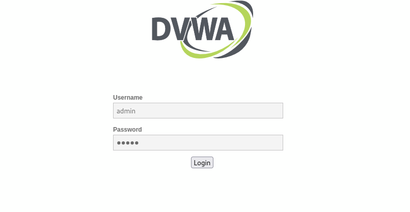
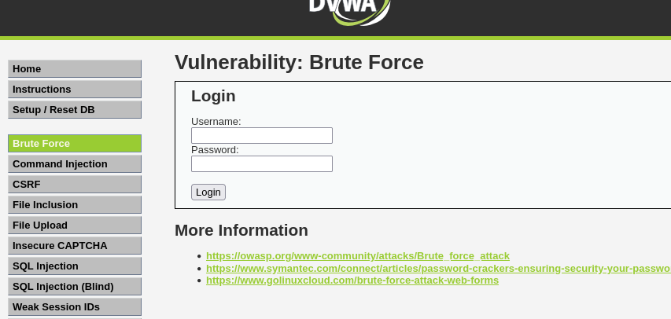
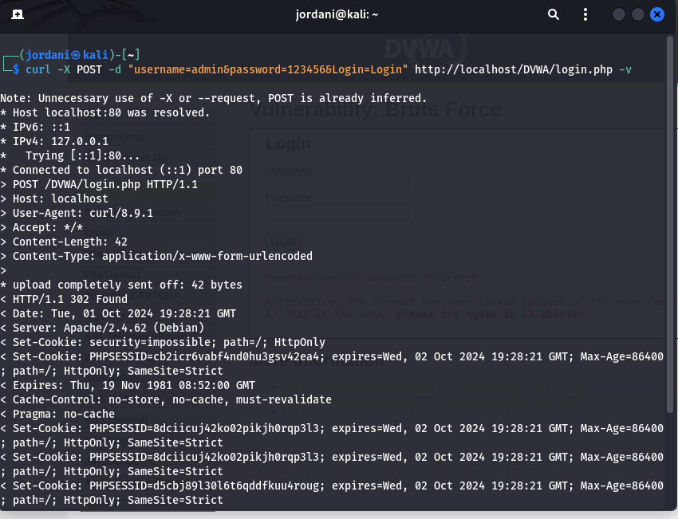

---
## Front matter
title: Отчёт о выполнении индивидуальный проект Этап 3""
subtitle: "Использование Hydra"
author: "Акондзо Жордани Лади Гаэл"

## Generic otions
lang: ru-RU
toc-title: "Содержание"

## Bibliography
bibliography: bib/cite.bib
csl: pandoc/csl/gost-r-7-0-5-2008-numeric.csl

## Pdf output format
toc: true # Table of contents
toc-depth: 2
lof: true # List of figures
lot: true # List of tables
fontsize: 12pt
linestretch: 1.5
papersize: a4
documentclass: scrreprt
## I18n polyglossia
polyglossia-lang:
  name: russian
  options:
	- spelling=modern
	- babelshorthands=true
polyglossia-otherlangs:
  name: english
## I18n babel
babel-lang: russian
babel-otherlangs: english
## Fonts
mainfont: PT Serif
romanfont: PT Serif
sansfont: PT Sans
monofont: PT Mono
mainfontoptions: Ligatures=TeX
romanfontoptions: Ligatures=TeX
sansfontoptions: Ligatures=TeX,Scale=MatchLowercase
monofontoptions: Scale=MatchLowercase,Scale=0.9
## Biblatex
biblatex: true
biblio-style: "gost-numeric"
biblatexoptions:
  - parentracker=true
  - backend=biber
  - hyperref=auto
  - language=auto
  - autolang=other*
  - citestyle=gost-numeric
## Pandoc-crossref LaTeX customization
figureTitle: "Рис."
lofTitle: "Список иллюстраций"
## Misc options
indent: true
header-includes:
  - \usepackage{indentfirst}
  - \usepackage{float} # keep figures where there are in the text
  - \floatplacement{figure}{H} # keep figures where there are in the text
---

# Цель работы

Научиться основным способам тестирования веб приложений

# Задание
* Найти максимальное количество уязвимостей различных типов.
* Реализовать успешную эксплуатацию каждой уязвимости.

# Теоретическое введение

**Hydra** — это мощный инструмент для атаки методом перебора (грубой силы) на различные сервисы, включая веб-формы HTTP. В этом этапе мы будем использовать Hydra для проверки безопасности формы аутентификации в приложении **DVWA**.

# Выполнение лабораторной работы

## Подготовка: Список Паролей
* Для выполнения атаки Hydra необходим список паролей. 
* **rockyou.txt** — один из самых популярных списков паролей в Kali Linux: (рис. [-@fig:001]).

{ #fig:001 width=70% }

* Сначала распаковал файл (рис. [-@fig:002]).

{ #fig:002 width=70% }

## Команда Hydra для Атаки на HTTP Форму
* Для выполнения атаки на форму аутентификации DVWA использовал следующую команду (рис. [-@fig:003]).

{ #fig:003 width=70% }

## Пояснение аргументов:
* -l admin: Имя пользователя для атаки (в данном случае — "admin").
* -P /usr/share/wordlists/rockyou.txt: Файл со списком паролей.
* -s 80: Порт, на котором работает веб-сервис (обычно порт 80).
* -f: Остановить атаку после нахождения правильной комбинации.
* -V: Подробный режим, отображающий каждую попытку.
* localhost: Адрес сервера (в данном случае — локально установленное DVWA).
* http-post-form: Указывает, что это форма HTTP, использующая метод POST.
* "/DVWA/login.php:username=^USER^&password=^PASS^:Login failed":
    * Путь к форме.
    * Шаблон для отправки имени пользователя и пароля.
    * Строка "Login failed" как индикатор неудачной попытки.

## Анализ Результатов
* После выполнения команды Hydra получим результат, который может выглядеть так:

```
[80][http-post-form] host: localhost   login: admin   password: 12345
[STATUS] attack finished for localhost (valid pair found)

```

### Проверка Найденного Пароля

* Чтобы убедиться, что найденная комбинация действительно работает, выполнил следующие действия (рис. [-@fig:004]) и (рис. [-@fig:005]).

   * Ручная проверка:

     * Открыл браузер и перешёл на страницу входа в DVWA: http://localhost/DVWA/login.php.
     * Ввел имя пользователя admin и пароль 12345.
     * Если вход выполнен успешно, это подтверждает, что Hydra нашла правильный пароль.

{ #fig:004 width=70% }

{ #fig:005 width=70% }

   * Проверка с помощью curl:
     * Можно тоже использовать команду curl, чтобы проверить результаты в терминале (рис. [-@fig:006]):
     ```
     curl -X POST -d "username=admin&password=12345&Login=Login" http://localhost/DVWA/login.php -v

     ```

{ #fig:006 width=70% }

  * Команда -v покажет ответ сервера, что поможет подтвердить успешность аутентификации.

# Выводы

На этом этапе я научилисся использовать **Hydra** для атаки методом грубой силы на форму входа в **DVWA** и проверять результаты атаки. Этот опыт демонстрирует, насколько важно использовать сложные пароли, чтобы предотвратить подобные атаки, и показывает, как инструменты автоматизации могут быть использованы злоумышленниками для нахождения слабых мест в системе безопасности.
