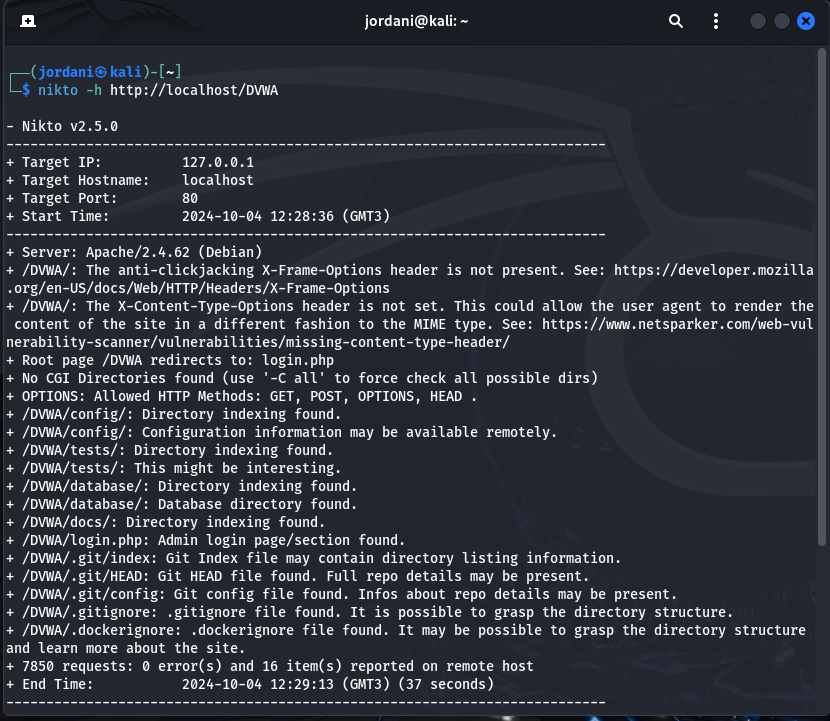
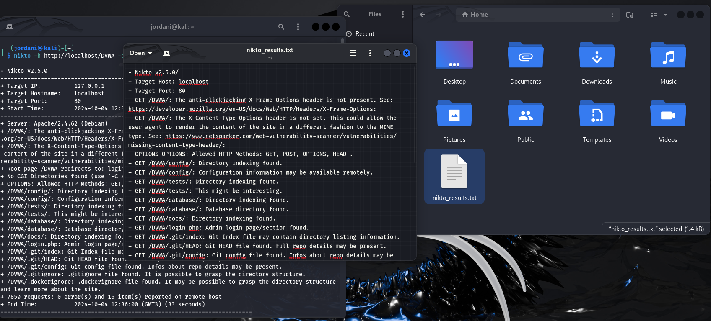

---
## Front matter
title: "Отчёт о выполнении индивидуальный проект Этап 4"
subtitle: "Использование Nikto для Сканирования Уязвимостей"
author: "Акондзо Жордани Лади Гаэл"

## Generic otions
lang: ru-RU
toc-title: "Содержание"

## Bibliography
bibliography: bib/cite.bib
csl: pandoc/csl/gost-r-7-0-5-2008-numeric.csl

## Pdf output format
toc: true # Table of contents
toc-depth: 2
lof: true # List of figures
lot: true # List of tables
fontsize: 12pt
linestretch: 1.5
papersize: a4
documentclass: scrreprt
## I18n polyglossia
polyglossia-lang:
  name: russian
  options:
	- spelling=modern
	- babelshorthands=true
polyglossia-otherlangs:
  name: english
## I18n babel
babel-lang: russian
babel-otherlangs: english
## Fonts
mainfont: PT Serif
romanfont: PT Serif
sansfont: PT Sans
monofont: PT Mono
mainfontoptions: Ligatures=TeX
romanfontoptions: Ligatures=TeX
sansfontoptions: Ligatures=TeX,Scale=MatchLowercase
monofontoptions: Scale=MatchLowercase,Scale=0.9
## Biblatex
biblatex: true
biblio-style: "gost-numeric"
biblatexoptions:
  - parentracker=true
  - backend=biber
  - hyperref=auto
  - language=auto
  - autolang=other*
  - citestyle=gost-numeric
## Pandoc-crossref LaTeX customization
figureTitle: "Рис."
lofTitle: "Список иллюстраций"
## Misc options
indent: true
header-includes:
  - \usepackage{indentfirst}
  - \usepackage{float} # keep figures where there are in the text
  - \floatplacement{figure}{H} # keep figures where there are in the text
---

# Общая информация

## Цель работы

* Научиться основным способам тестирования веб приложений

## Введение

* Ищутся уязвимости в специально предназначенном для этого веб приложении под названием **Damn Vulnerable Web Application (DVWA)**.
* Назначение **DVWA** — попрактиковаться в некоторых самых распространённых веб уязвимостях.
* Предлагается попробовать и обнаружить так много уязвимостей, как сможете.

## Задачи

* Найти максимальное количество уязвимостей различных типов.
* Реализовать успешную эксплуатацию каждой уязвимости.

## Инструменты

* Для тестирования должен использоваться дистрибутив Kali Linux.
* Можно пользоваться любыми инструментами дистрибутива.

# Теоретическое введение

**Nikto** — это инструмент с открытым исходным кодом для сканирования веб-уязвимостей, который позволяет обнаруживать распространенные проблемы безопасности на веб-серверах, такие как небезопасные файлы, уязвимые конфигурации или устаревшие версии программного обеспечения. **Nikto** уже предустановлен на **Kali Linux**, что делает его использование простым и удобным для вашего проекта.

## Введение в Nikto

* Nikto используется для проверки безопасности веб-серверов и приложений, сканируя заголовки HTTP, файлы конфигурации и версии программного обеспечения для обнаружения известных уязвимостей.
* Инструмент особенно полезен для тестирования безопасности на начальном этапе, так как он предоставляет исчерпывающий отчет о всех найденных проблемах.

# Выполнение лабораторной работы

## Использование Nikto

* Для выполнения сканирования я использовал следующую команду: (рис. [-@fig:001])

{ #fig:001 width=70% }

* Эта команда запускает полное сканирование на адресе localhost и проверяет уязвимости, характерные для веб-приложений.

## Дополнительные Опции Сканирования

* Сохранение результатов сканирования в файл: (рис. [-@fig:002])

{ #fig:002 width=70% }

* Я сохранил результаты в файл для более детального анализа и для документирования проделанной работы.

## Результаты Сканирования

* Согласно результатам сканирования Nikto, были обнаружены несколько уязвимостей:

**1. Отсутствие заголовков безопасности:**

* **X-Frame-Options отсутствует**, что делает приложение уязвимым для атак **Clickjacking**. Рекомендовано добавить этот заголовок для предотвращения загрузки страницы в **iframe** третьими лицами.
* **X-Content-Type-Options** также не установлен, что потенциально позволяет браузеру интерпретировать содержимое неправильно.

**2. Индексирование каталогов:**

* Были найдены каталоги **/config/, /tests/, /database/** с включенной функцией индексирования, что позволяет пользователю видеть содержимое каталогов и, возможно, получить доступ к конфиденциальной информации. Для повышения безопасности я рекомендую отключить индексирование этих каталогов с помощью **.htaccess.**

**3. Файлы конфигурации Git и Docker:**

* Были обнаружены файлы **.git/config, .gitignore, и .dockerignore**, которые могут содержать критически важную информацию о структуре приложения. Я заблокировал доступ к этим файлам, чтобы предотвратить возможные атаки.

# Выводы

Использование **Nikto** позволило мне не только выявить текущие проблемы безопасности, но и лучше понять, как неправильные конфигурации могут сделать приложение уязвимым для атак. Я получил ценный опыт в анализе безопасности веб-приложений и в настройке веб-сервера для обеспечения защиты от известных угроз.

